# AlSafwa Cement Portal — User Guide and UAT

> Client-facing operating guide and user acceptance testing evidence

## Table of Contents

- [Document Control](#document-control)
- [Document Purpose](#document-purpose)
- [Portal Overview](#portal-overview)
- [User Roles & Responsibilities](#user-roles--responsibilities)
- [Login & Access](#login--access)
- [Customer Registration](#customer-registration)
- [Customer Portal](#customer-portal)
- [Sales / Quotations](#sales--quotations)
- [Contract](#contract)
- [Orders](#orders)
- [Hader Delivery](#hader-delivery)
- [Proof of Delivery (POD)](#proof-of-delivery-pod)
- [Ship-to Variance](#ship-to-variance)
- [Pricing Administrator](#pricing-administrator)
- [Commercial Director](#commercial-director)
- [Portal Administrator](#portal-administrator)
- [End-to-End Workflow](#end-to-end-workflow)
- [UAT Testing Guide](#uat-testing-guide)
- [UAT Testing Checklist](#uat-testing-checklist)
- [Known Limitations & Pending Features](#known-limitations--pending-features)
- [UAT Sign-Off](#uat-sign-off)
- [Screenshot Evidence Register](#screenshot-evidence-register)

## Document Control

| Field | Value |
| --- | --- |
| Document owner | AlSafwa Cement |
| Prepared for | AlSafwa Cement Portal End Users |
| Version | 2.0 |
| Classification | Client Use |
| Generated | 2026-08-31T12:13:27.792Z |
| Screenshot evidence | 95 file(s) |
| Screenshot numbering | 01–96; missing prefix(es): 19 |

## Document Purpose

This document provides client-facing operating guidance and User Acceptance Testing (UAT) evidence for confirmed AlSafwa Cement Portal functionality. It uses only screenshots captured from the running application and separates implemented functionality from pending or unverified work.

## Portal Overview

The AlSafwa Cement Portal provides role-based customer onboarding, customer self-service, Sales review, pricing administration, Hader operations, commercial approval, and portal administration capabilities. The options visible to each user depend on their authenticated role and existing permissions.

**Confirmed guide areas**

- Customer registration, Sales review, approval, and activation
- Role-based Customer, Sales, Pricing, Hader, Commercial Director, and Portal Administrator access
- Products, quotations, commercial review, customer decision, and document preview
- Accepted quotation to contract creation and contract activation
- Direct and contract order creation with Sales processing
- Hader delivery request, shipment, assignment, loading, dispatch, delivery, POD, and closure
- Ship-to Variance calculation, extra-charge request, and Commercial Director approval
- Product, delivery, logistics, pickup-location, and VAT configuration
- Internal and customer user management
- Global in-portal notifications

## User Roles & Responsibilities

| Role | Responsibility in this guide |
| --- | --- |
| Customer Administrator | Manages the customer account, customer users, locations, and all currently implemented customer workflows. |
| Purchaser | Creates quotations and orders and follows purchasing and fulfilment workflows permitted to the role. |
| Finance User | Uses the currently implemented customer read-only areas; ERP-dependent finance modules remain pending. |
| Viewer | Uses permitted read-only Customer Portal information without administrative or transactional actions. |
| Sales Representative | Reviews registrations, quotations, contracts, and submitted customer orders. |
| Price Manager | Reviews product-price exceptions and manages Ship-to Variance charge requests. |
| Commercial Director | Approves or rejects raised Ship-to Variance extra-charge requests. |
| Pricing Administrator | Maintains products, product and delivery prices, logistics configuration, pickup locations, and VAT configuration. |
| Hader Manager | Coordinates delivery requests, shipments, dispatch, loading, delivery execution, and proof of delivery. |
| Portal Administrator | Manages internal portal users and global portal notifications. |

## Login & Access

Portal base address: [http://20.46.44.59/](http://20.46.44.59/)

| Role | Login URL | Access note |
| --- | --- | --- |
| Customer Administrator | [http://20.46.44.59/login](http://20.46.44.59/login) | Shared Customer Portal login; access is determined by the assigned customer role. |
| Purchaser | [http://20.46.44.59/login](http://20.46.44.59/login) | Shared Customer Portal login; access is determined by the assigned customer role. |
| Finance User | [http://20.46.44.59/login](http://20.46.44.59/login) | Shared Customer Portal login; access is determined by the assigned customer role. |
| Viewer | [http://20.46.44.59/login](http://20.46.44.59/login) | Shared Customer Portal login; access is determined by the assigned customer role. |
| Sales Representative | [http://20.46.44.59/sales/login](http://20.46.44.59/sales/login) | Shared internal login; the authenticated role determines the landing page and navigation. |
| Price Manager | [http://20.46.44.59/sales/login](http://20.46.44.59/sales/login) | Shared internal login; access is role-based. |
| Commercial Director | [http://20.46.44.59/sales/login](http://20.46.44.59/sales/login) | Shared internal login; access is role-based. |
| Pricing Administrator | [http://20.46.44.59/sales/login](http://20.46.44.59/sales/login) | Shared internal login; access is role-based. |
| Hader Manager | [http://20.46.44.59/sales/login](http://20.46.44.59/sales/login) | Shared internal login; access is role-based. |
| Portal Administrator | [http://20.46.44.59/admin/login](http://20.46.44.59/admin/login) | Dedicated Portal Administrator entry point using the existing internal authentication service. |

1. Open the login URL assigned to your role.
2. Sign in using credentials issued through the approved administration process.
3. Confirm that the displayed navigation matches your assigned responsibilities.
4. Use only approved UAT data and sign out when testing is complete.

> Internal operational roles share `/sales/login`; the authenticated role controls the landing page, navigation, and protected routes.
> Security note: Credentials and authentication secrets are intentionally excluded from this document.

## Customer Registration

**Audience:** Prospective customer and Sales Representative

Register an organization, provide required business information, submit it for Sales review, and activate an approved customer account.

**Procedure**

1. Start the organization registration and complete company and contact information.
2. Upload required documents, add delivery locations, and set map coordinates.
3. Nominate the Customer Administrator, review the application, and submit it.
4. Sales reviews, approves, and activates the customer account through the authorized workflow.

<figure id="figure-1">
  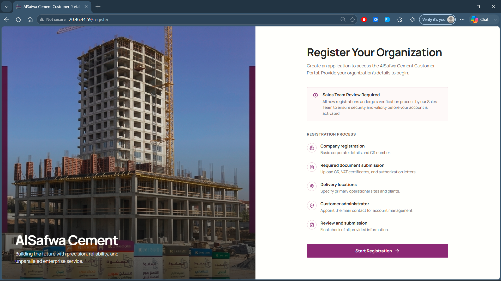
  <figcaption><strong>Figure 1:</strong> Customer Registration Start — This screen shows customer registration start in the implemented Customer Registration workflow. Use the displayed information and available actions to complete or verify this business step.</figcaption>
</figure>

<figure id="figure-2">
  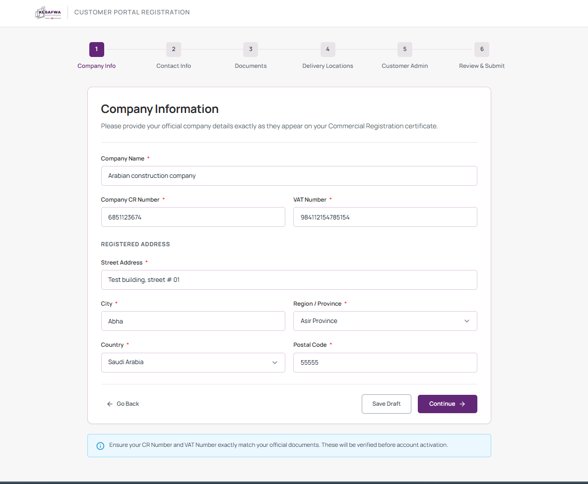
  <figcaption><strong>Figure 2:</strong> Company Information — This screen shows company information in the implemented Customer Registration workflow. Use the displayed information and available actions to complete or verify this business step.</figcaption>
</figure>

<figure id="figure-3">
  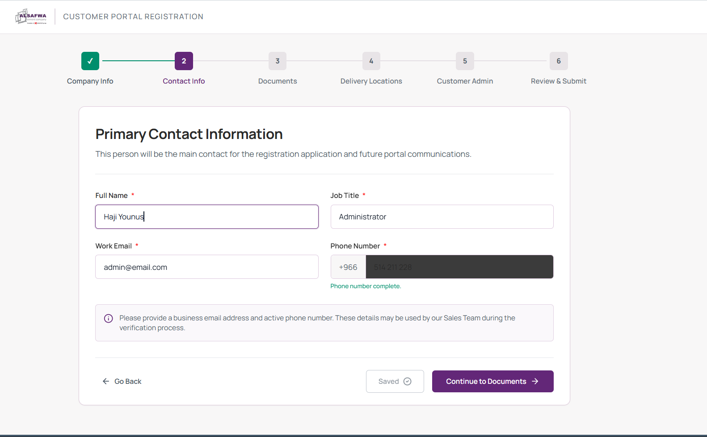
  <figcaption><strong>Figure 3:</strong> Contact Information — This screen shows contact information in the implemented Customer Registration workflow. Use the displayed information and available actions to complete or verify this business step.</figcaption>
</figure>

<figure id="figure-4">
  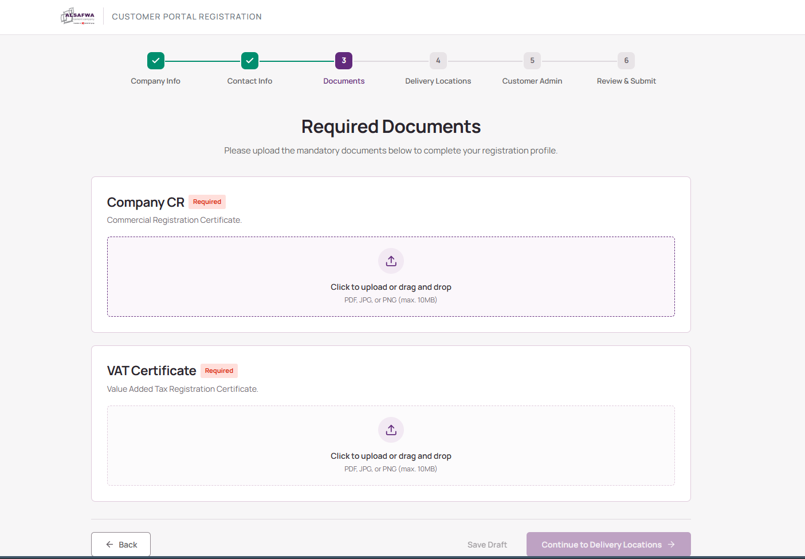
  <figcaption><strong>Figure 4:</strong> Documents — This screen shows documents in the implemented Customer Registration workflow. Use the displayed information and available actions to complete or verify this business step.</figcaption>
</figure>

<figure id="figure-5">
  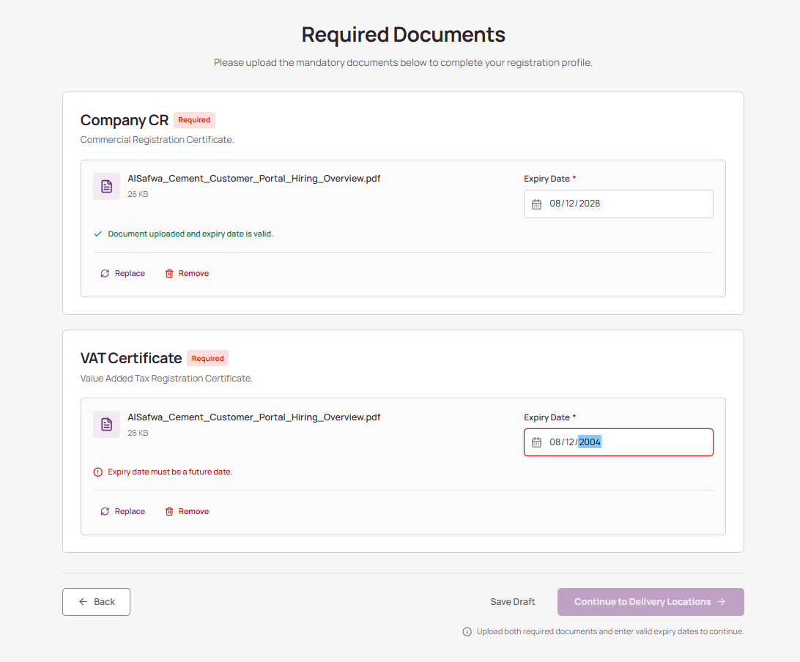
  <figcaption><strong>Figure 5:</strong> Delivery Locations — This screen shows delivery locations in the implemented Customer Registration workflow. Use the displayed information and available actions to complete or verify this business step.</figcaption>
</figure>

<figure id="figure-6">
  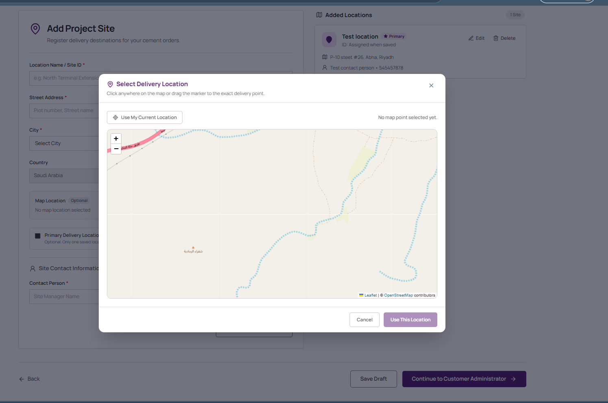
  <figcaption><strong>Figure 6:</strong> Set Map Location — This screen shows set map location in the implemented Customer Registration workflow. Use the displayed information and available actions to complete or verify this business step.</figcaption>
</figure>

<figure id="figure-7">
  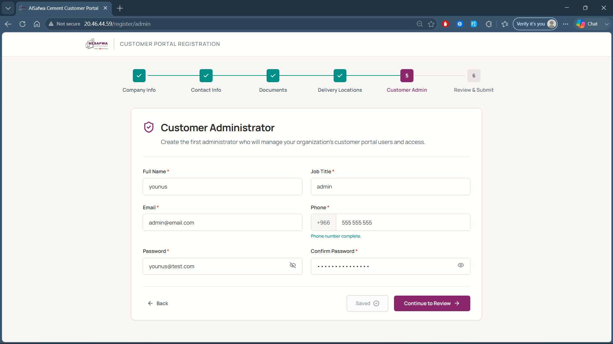
  <figcaption><strong>Figure 7:</strong> Customer Admin — This screen shows customer admin in the implemented Customer Registration workflow. Use the displayed information and available actions to complete or verify this business step.</figcaption>
</figure>

<figure id="figure-8">
  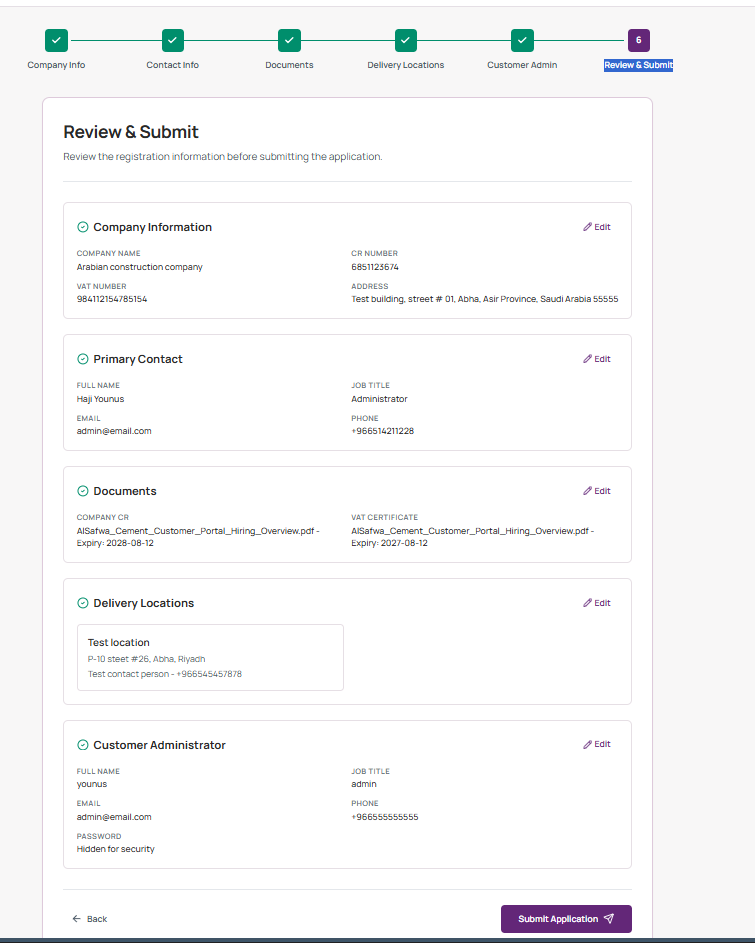
  <figcaption><strong>Figure 8:</strong> Registration Review Submit — This screen shows registration review submit in the implemented Customer Registration workflow. Use the displayed information and available actions to complete or verify this business step.</figcaption>
</figure>

<figure id="figure-9">
  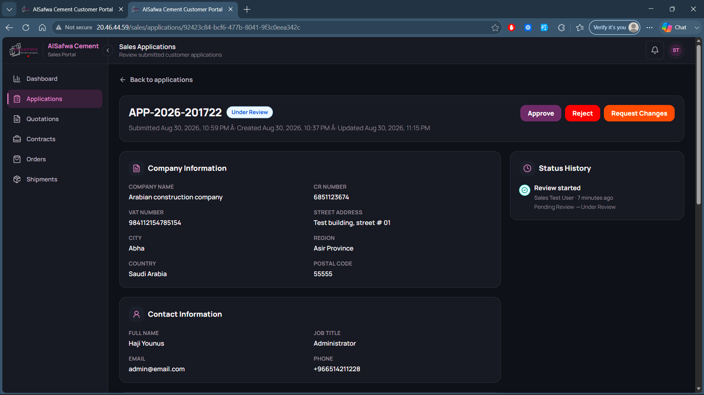
  <figcaption><strong>Figure 9:</strong> Sales Registration Review — This screen shows sales registration review in the implemented Customer Registration workflow. Use the displayed information and available actions to complete or verify this business step.</figcaption>
</figure>

<figure id="figure-10">
  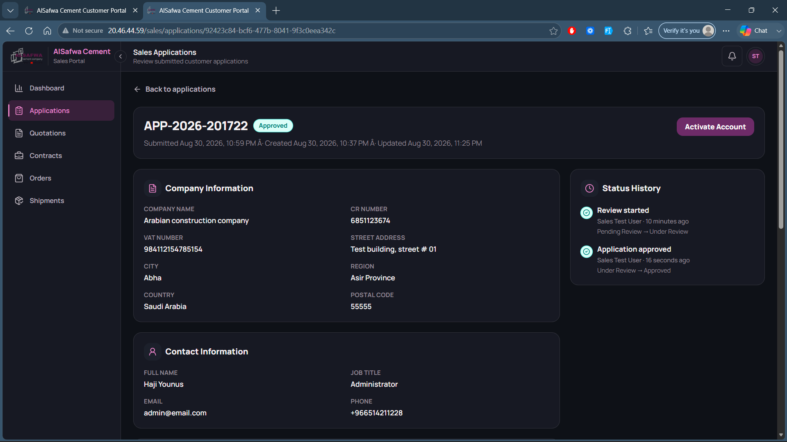
  <figcaption><strong>Figure 10:</strong> Sales Approve — This screen shows sales approve in the implemented Customer Registration workflow. Use the displayed information and available actions to complete or verify this business step.</figcaption>
</figure>

<figure id="figure-11">
  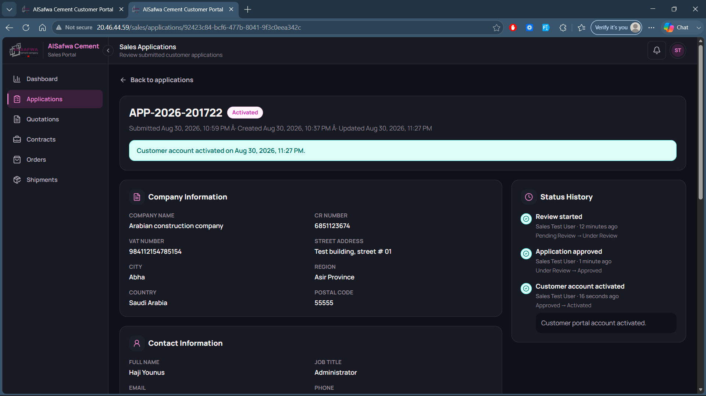
  <figcaption><strong>Figure 11:</strong> Approve Customer Account — This screen shows approve customer account in the implemented Customer Registration workflow. Use the displayed information and available actions to complete or verify this business step.</figcaption>
</figure>

<figure id="figure-12">
  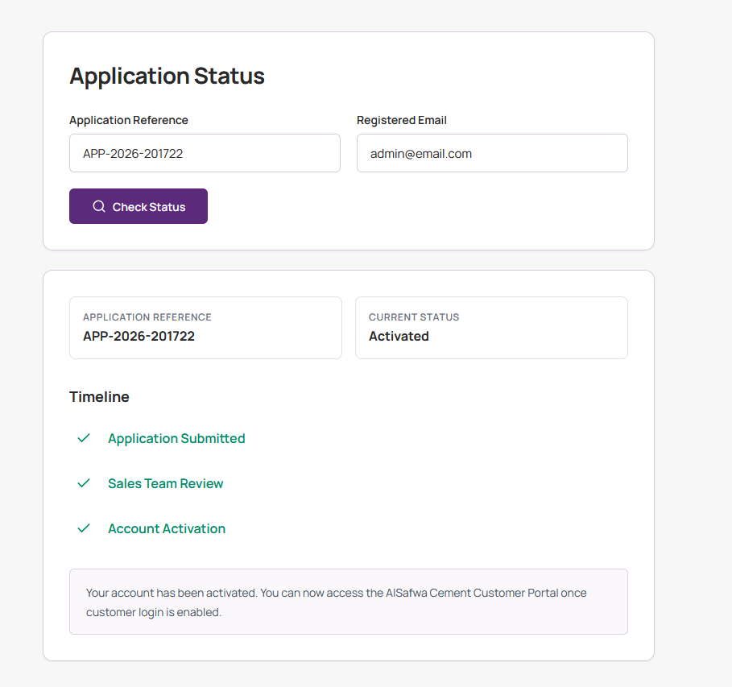
  <figcaption><strong>Figure 12:</strong> Customer Registration Result Application Status — This screen shows customer registration result application status in the implemented Customer Registration workflow. Use the displayed information and available actions to complete or verify this business step.</figcaption>
</figure>

## Customer Portal

**Audience:** Customer Administrator, Purchaser, Finance User, and Viewer according to role permissions

Use the authenticated Customer Portal to view account information, products, quotations, direct orders, order details, and delivery locations according to the assigned role.

**Procedure**

1. Sign in through the shared Customer Portal login.
2. Use the dashboard and role-aware navigation to open permitted modules.
3. Review product details and create quotation or direct-order requests where authorized.
4. Maintain mapped Ship-to locations before using them for delivery orders.

<figure id="figure-13">
  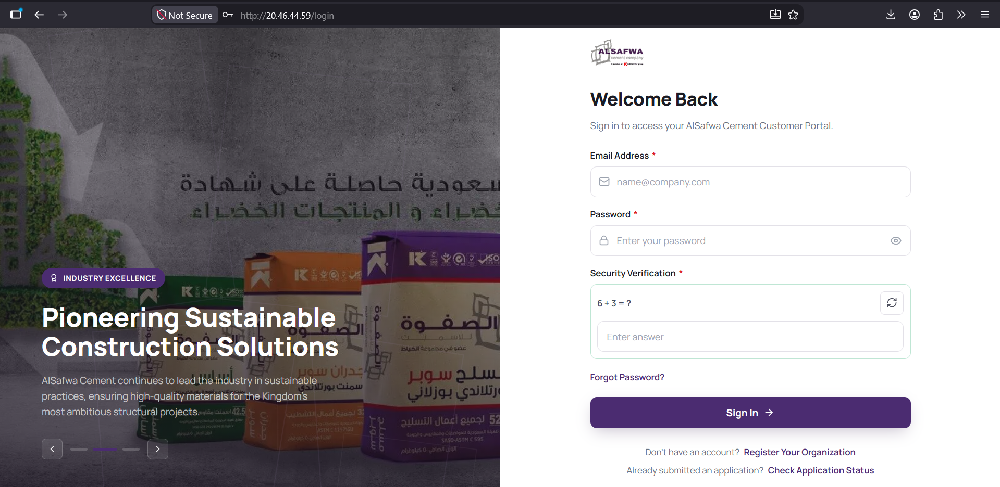
  <figcaption><strong>Figure 13:</strong> Customer Login — This screen shows customer login in the implemented Customer Portal workflow. Use the displayed information and available actions to complete or verify this business step.</figcaption>
</figure>

<figure id="figure-14">
  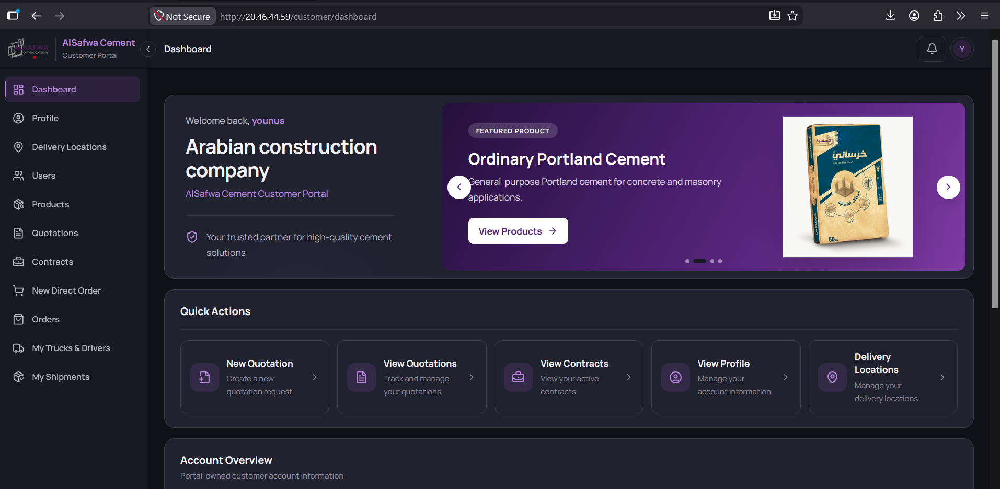
  <figcaption><strong>Figure 14:</strong> Customer Dashboard — This screen shows customer dashboard in the implemented Customer Portal workflow. Use the displayed information and available actions to complete or verify this business step.</figcaption>
</figure>

<figure id="figure-15">
  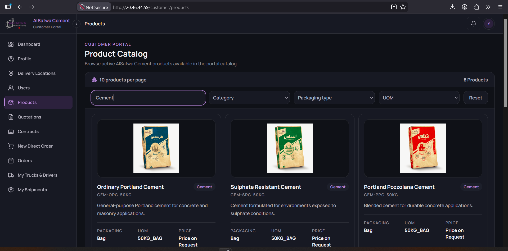
  <figcaption><strong>Figure 15:</strong> Customer Products — This screen shows customer products in the implemented Customer Portal workflow. Use the displayed information and available actions to complete or verify this business step.</figcaption>
</figure>

<figure id="figure-16">
  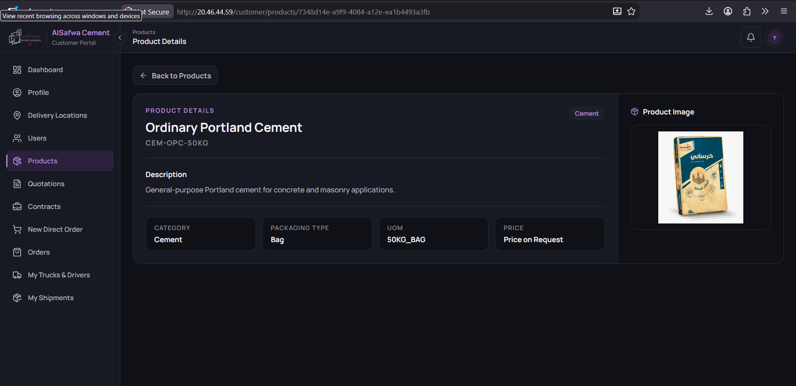
  <figcaption><strong>Figure 16:</strong> Customer Product Detail — This screen shows customer product detail in the implemented Customer Portal workflow. Use the displayed information and available actions to complete or verify this business step.</figcaption>
</figure>

<figure id="figure-17">
  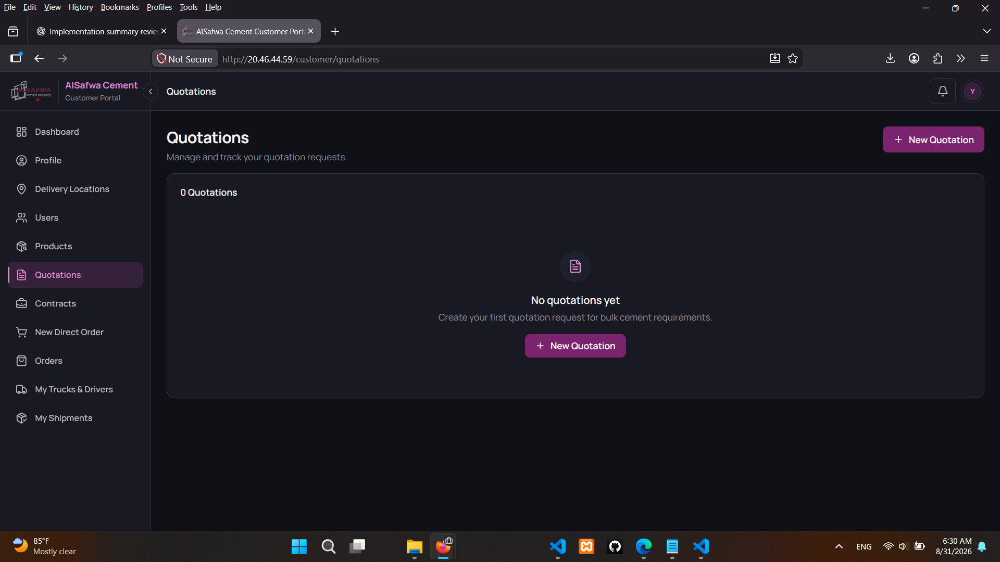
  <figcaption><strong>Figure 17:</strong> Customer Quotation — This screen shows customer quotation in the implemented Customer Portal workflow. Use the displayed information and available actions to complete or verify this business step.</figcaption>
</figure>

<figure id="figure-18">
  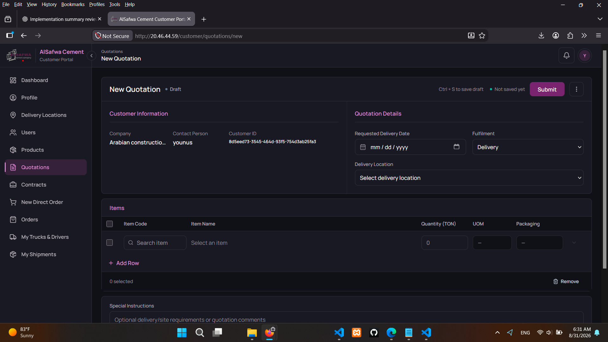
  <figcaption><strong>Figure 18:</strong> New Customer Quotation — This screen shows new customer quotation in the implemented Customer Portal workflow. Use the displayed information and available actions to complete or verify this business step.</figcaption>
</figure>

<figure id="figure-19">
  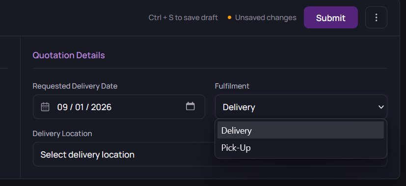
  <figcaption><strong>Figure 19:</strong> Customer Quotation Details — This screen shows customer quotation details in the implemented Customer Portal workflow. Use the displayed information and available actions to complete or verify this business step.</figcaption>
</figure>

<figure id="figure-20">
  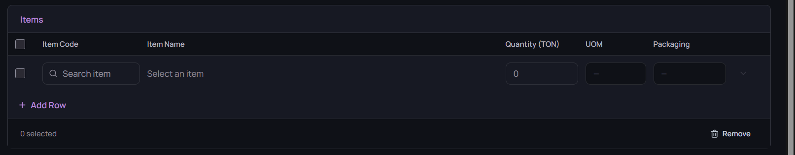
  <figcaption><strong>Figure 20:</strong> Add Items To Quotation — This screen shows add items to quotation in the implemented Customer Portal workflow. Use the displayed information and available actions to complete or verify this business step.</figcaption>
</figure>

<figure id="figure-21">
  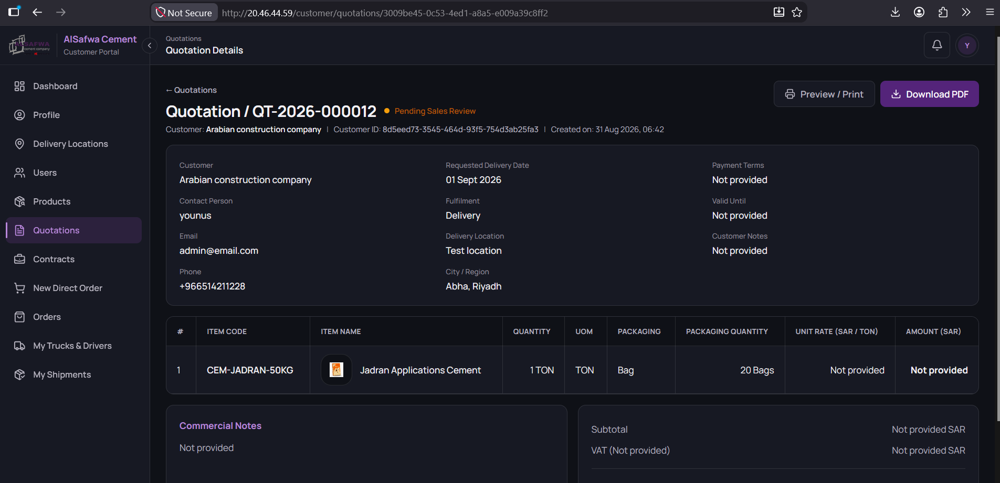
  <figcaption><strong>Figure 21:</strong> Quotation Created Pending Sales Review — This screen shows quotation created pending sales review in the implemented Customer Portal workflow. Use the displayed information and available actions to complete or verify this business step.</figcaption>
</figure>

<figure id="figure-22">
  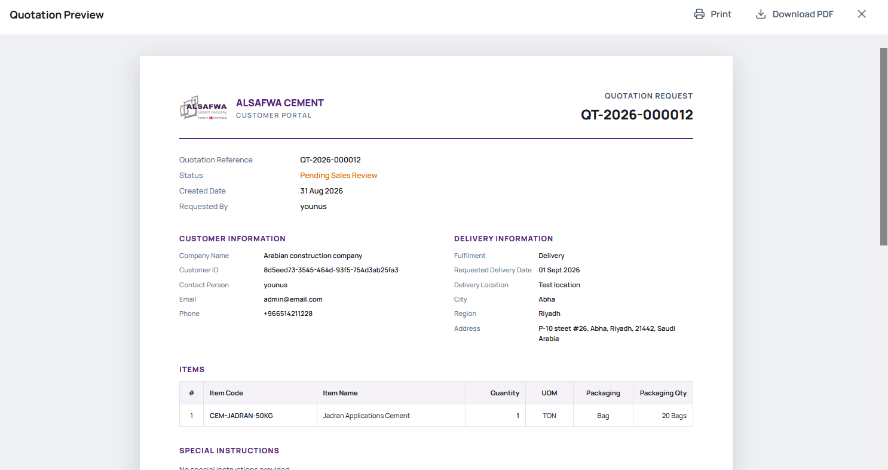
  <figcaption><strong>Figure 22:</strong> Customer Quotation Review — This screen shows customer quotation review in the implemented Customer Portal workflow. Use the displayed information and available actions to complete or verify this business step.</figcaption>
</figure>

<figure id="figure-23">
  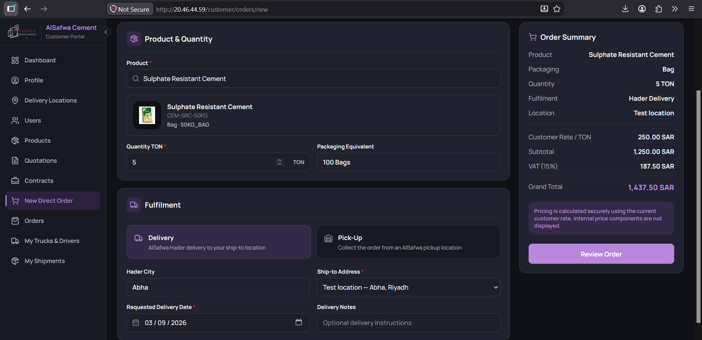
  <figcaption><strong>Figure 23:</strong> Customer Direct Order — This screen shows customer direct order in the implemented Customer Portal workflow. Use the displayed information and available actions to complete or verify this business step.</figcaption>
</figure>

<figure id="figure-24">
  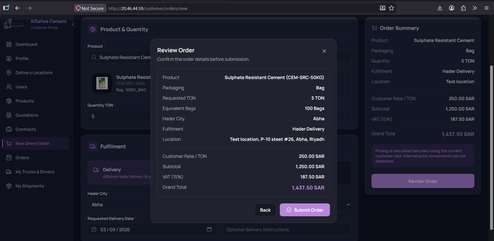
  <figcaption><strong>Figure 24:</strong> Customer Order Review — This screen shows customer order review in the implemented Customer Portal workflow. Use the displayed information and available actions to complete or verify this business step.</figcaption>
</figure>

<figure id="figure-25">
  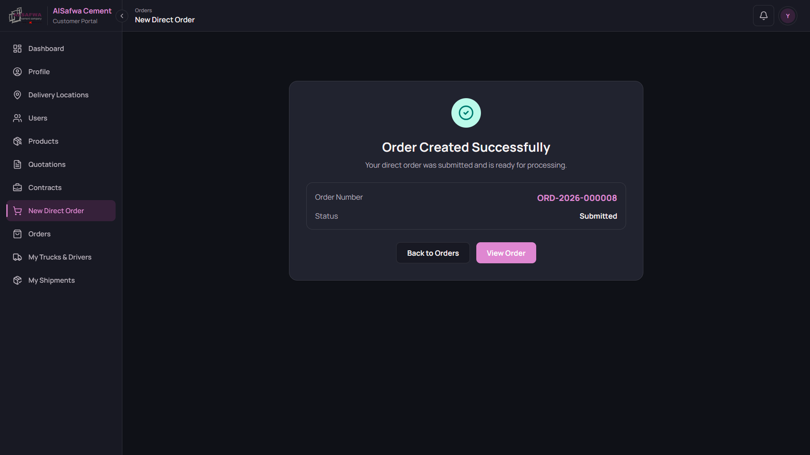
  <figcaption><strong>Figure 25:</strong> Customer Order Created — This screen shows customer order created in the implemented Customer Portal workflow. Use the displayed information and available actions to complete or verify this business step.</figcaption>
</figure>

<figure id="figure-26">
  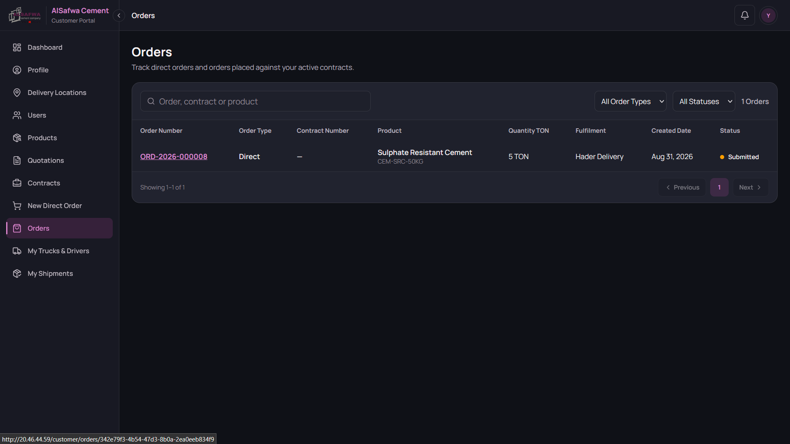
  <figcaption><strong>Figure 26:</strong> Customer Order Details — This screen shows customer order details in the implemented Customer Portal workflow. Use the displayed information and available actions to complete or verify this business step.</figcaption>
</figure>

<figure id="figure-27">
  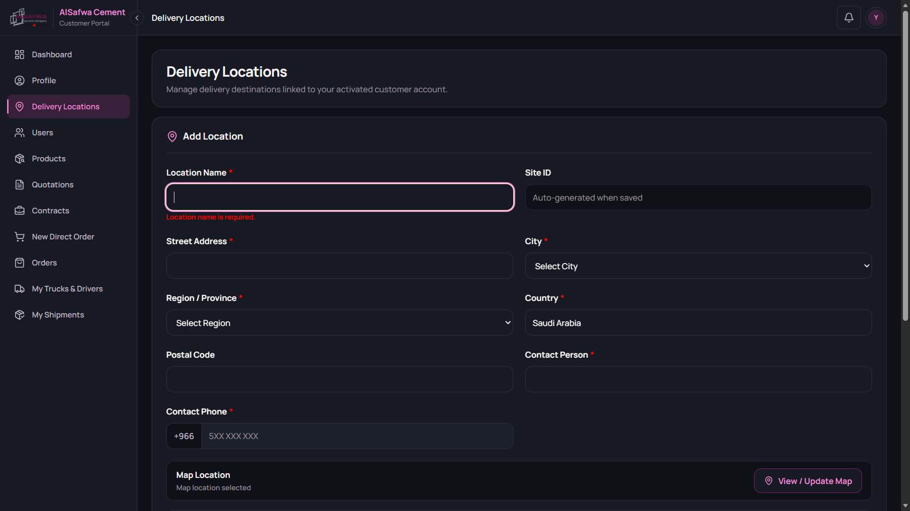
  <figcaption><strong>Figure 27:</strong> Customer Ship-to Locations — This screen shows customer ship-to locations in the implemented Customer Portal workflow. Use the displayed information and available actions to complete or verify this business step.</figcaption>
</figure>

## Sales / Quotations

**Audience:** Sales Representative and customer quotation participants

Review customer registrations and quotation requests, apply approved commercial pricing, send quotations to customers, and record the customer decision.

**Procedure**

1. Sign in through the shared internal login and open the relevant Sales queue.
2. Review the quotation requirements and start the review when valid.
3. Apply the configured commercial pricing and required approval path.
4. Send the final quotation to the customer for acceptance or another supported decision.

<figure id="figure-28">
  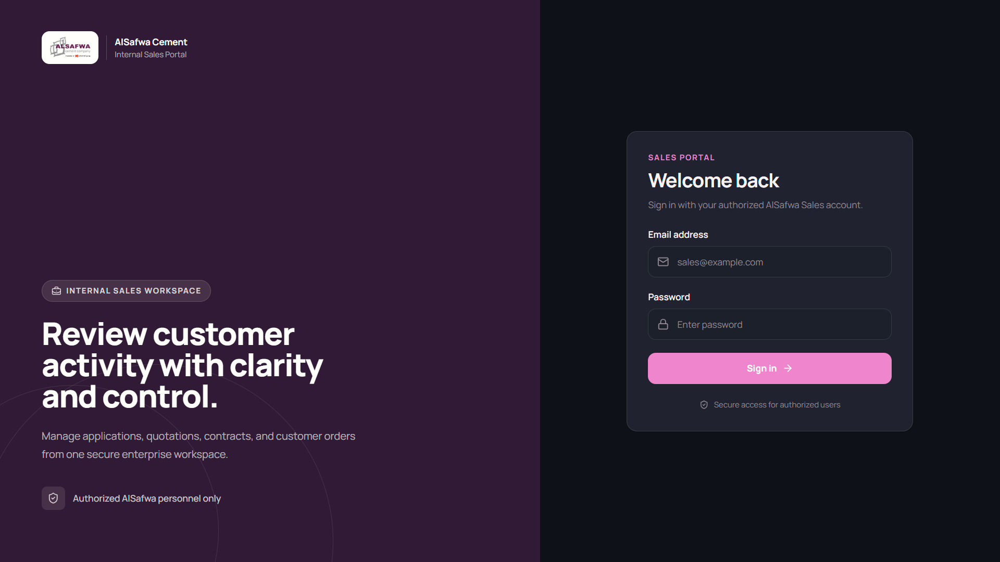
  <figcaption><strong>Figure 28:</strong> Sales Login — This screen shows sales login in the implemented Sales / Quotations workflow. Use the displayed information and available actions to complete or verify this business step.</figcaption>
</figure>

<figure id="figure-29">
  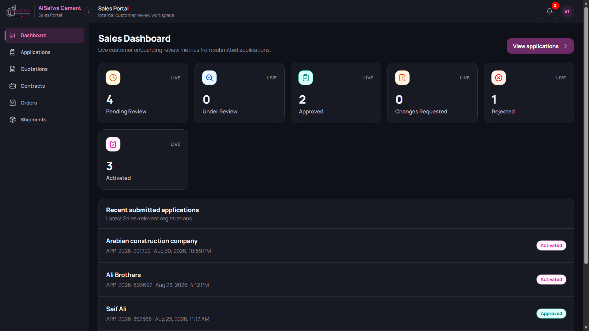
  <figcaption><strong>Figure 29:</strong> Sales Dashboard — This screen shows sales dashboard in the implemented Sales / Quotations workflow. Use the displayed information and available actions to complete or verify this business step.</figcaption>
</figure>

<figure id="figure-30">
  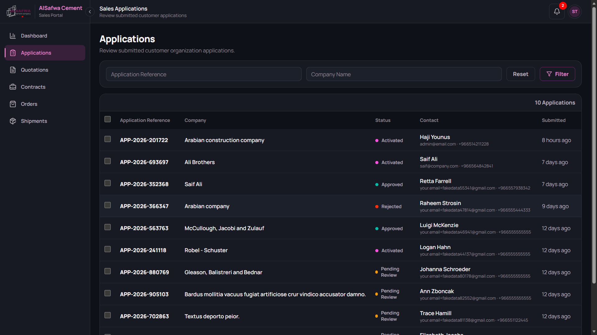
  <figcaption><strong>Figure 30:</strong> Sales Applications — This screen shows sales applications in the implemented Sales / Quotations workflow. Use the displayed information and available actions to complete or verify this business step.</figcaption>
</figure>

<figure id="figure-31">
  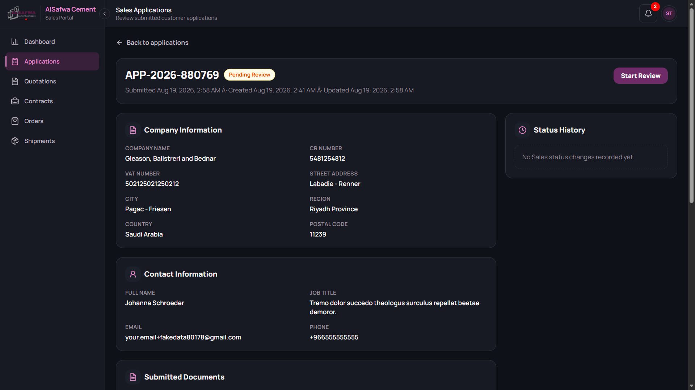
  <figcaption><strong>Figure 31:</strong> Sales Application Details — This screen shows sales application details in the implemented Sales / Quotations workflow. Use the displayed information and available actions to complete or verify this business step.</figcaption>
</figure>

<figure id="figure-32">
  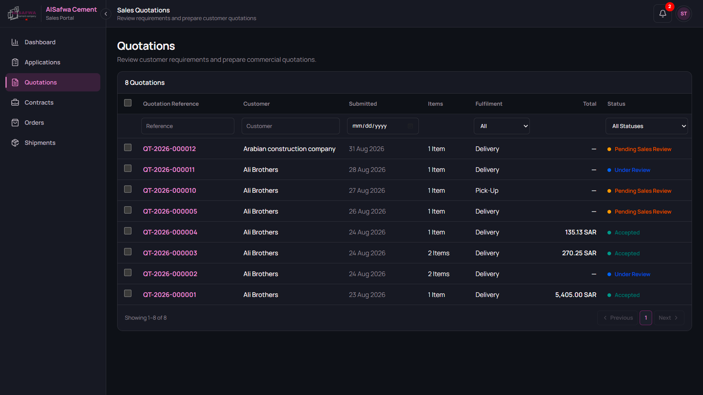
  <figcaption><strong>Figure 32:</strong> Sales Quotation List — This screen shows sales quotation list in the implemented Sales / Quotations workflow. Use the displayed information and available actions to complete or verify this business step.</figcaption>
</figure>

<figure id="figure-33">
  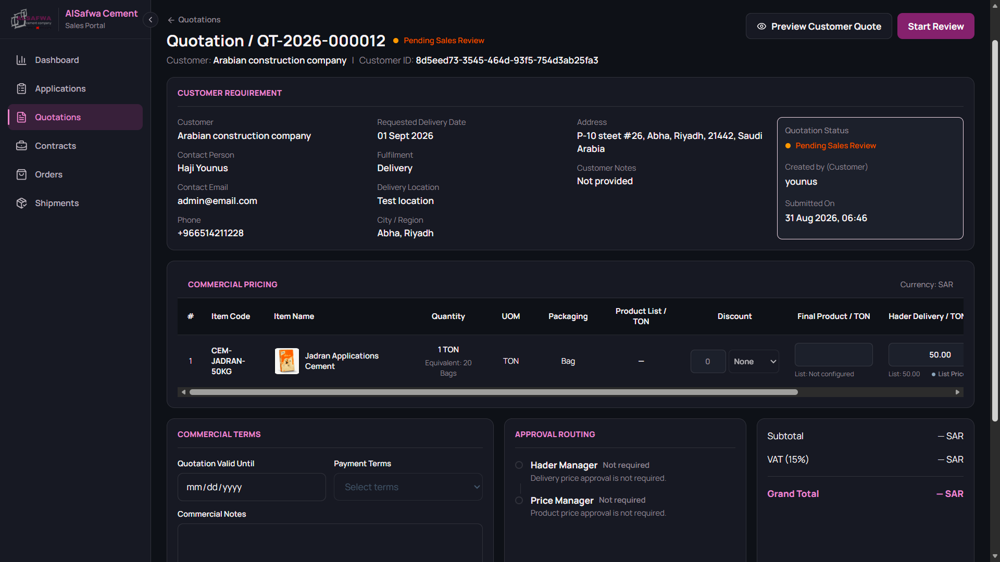
  <figcaption><strong>Figure 33:</strong> Sales Quotation Details — This screen shows sales quotation details in the implemented Sales / Quotations workflow. Use the displayed information and available actions to complete or verify this business step.</figcaption>
</figure>

<figure id="figure-34">
  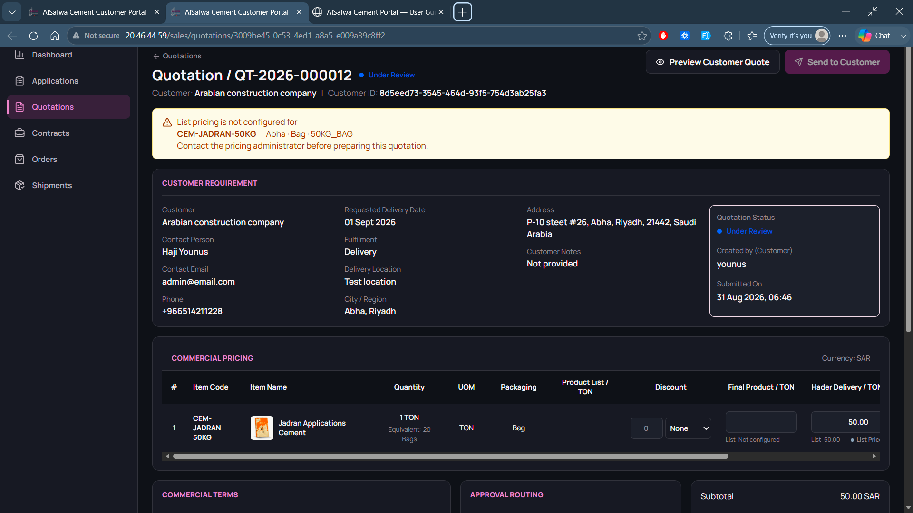
  <figcaption><strong>Figure 34:</strong> Sales Quotation Review — This screen shows sales quotation review in the implemented Sales / Quotations workflow. Use the displayed information and available actions to complete or verify this business step.</figcaption>
</figure>

<figure id="figure-35">
  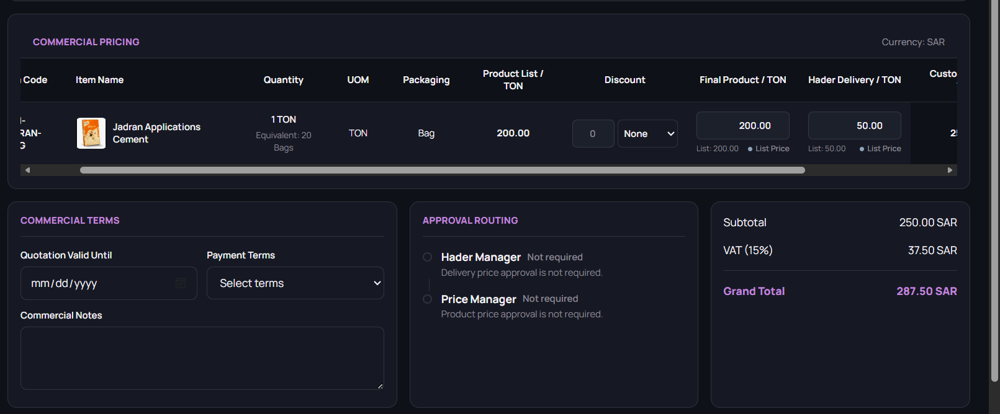
  <figcaption><strong>Figure 35:</strong> Sales Quotation Commercial Pricing — This screen shows sales quotation commercial pricing in the implemented Sales / Quotations workflow. Use the displayed information and available actions to complete or verify this business step.</figcaption>
</figure>

<figure id="figure-36">
  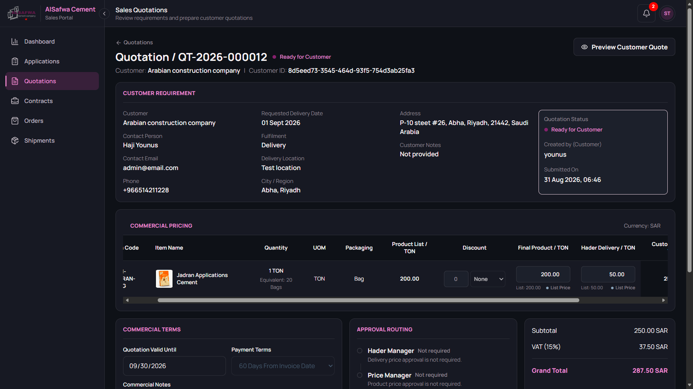
  <figcaption><strong>Figure 36:</strong> Sales Quotation Send To Customer For Approval — This screen shows sales quotation send to customer for approval in the implemented Sales / Quotations workflow. Use the displayed information and available actions to complete or verify this business step.</figcaption>
</figure>

<figure id="figure-37">
  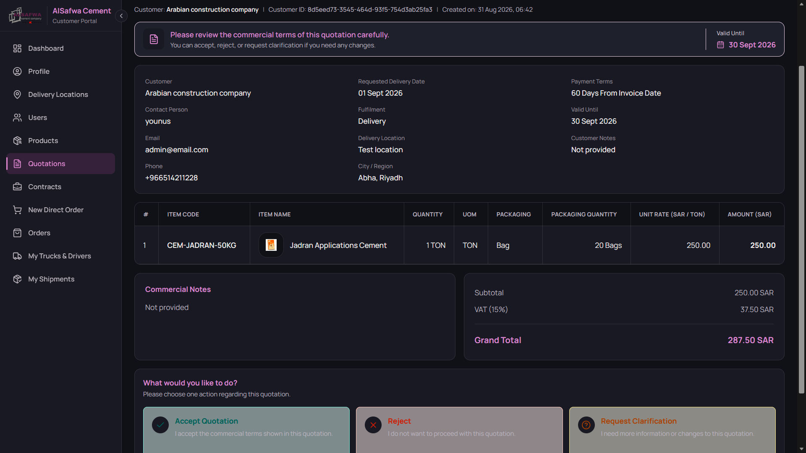
  <figcaption><strong>Figure 37:</strong> Customer Quotation Approval — This screen shows customer quotation approval in the implemented Sales / Quotations workflow. Use the displayed information and available actions to complete or verify this business step.</figcaption>
</figure>

<figure id="figure-38">
  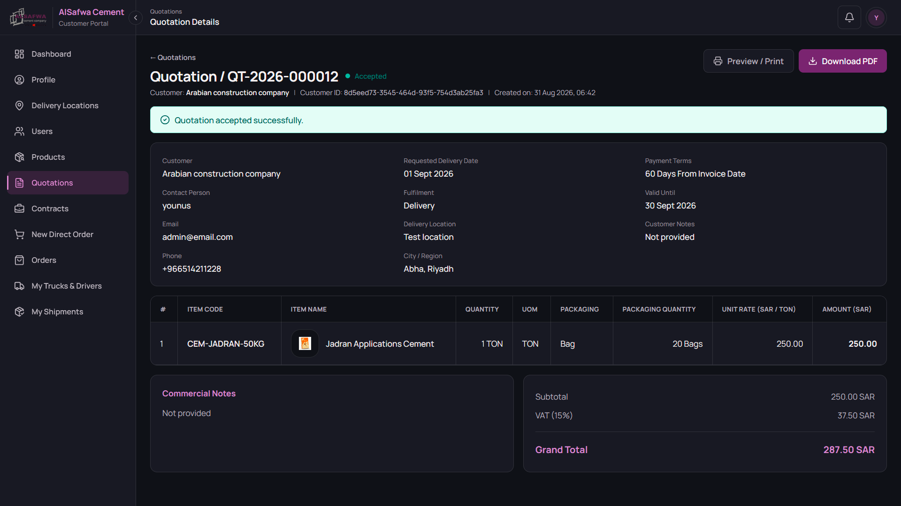
  <figcaption><strong>Figure 38:</strong> Customer Quotation Approved — This screen shows customer quotation approved in the implemented Sales / Quotations workflow. Use the displayed information and available actions to complete or verify this business step.</figcaption>
</figure>

## Contract

**Audience:** Sales Representative and Customer Portal users with contract access

Convert an accepted quotation into a draft contract, review the inherited commercial snapshot, activate the contract, and make the active contract visible to the customer.

**Procedure**

1. Open an accepted quotation and select Create Contract.
2. Enter only the permitted contract-specific information and confirm creation.
3. Review the draft contract and activate it when valid.
4. Confirm that the active contract is visible in the Customer Portal.

<figure id="figure-39">
  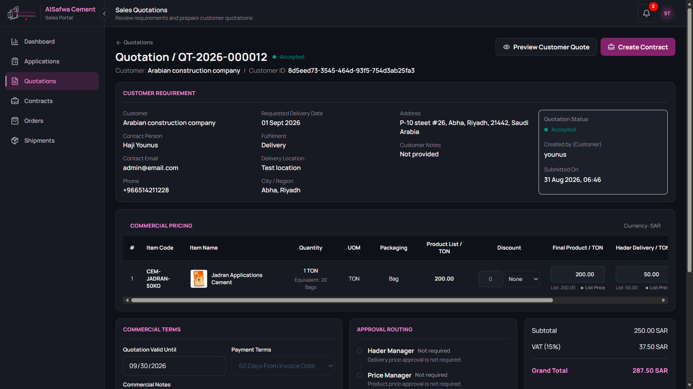
  <figcaption><strong>Figure 39:</strong> Sales Approved Quotation — This screen shows sales approved quotation in the implemented Contract workflow. Use the displayed information and available actions to complete or verify this business step.</figcaption>
</figure>

<figure id="figure-40">
  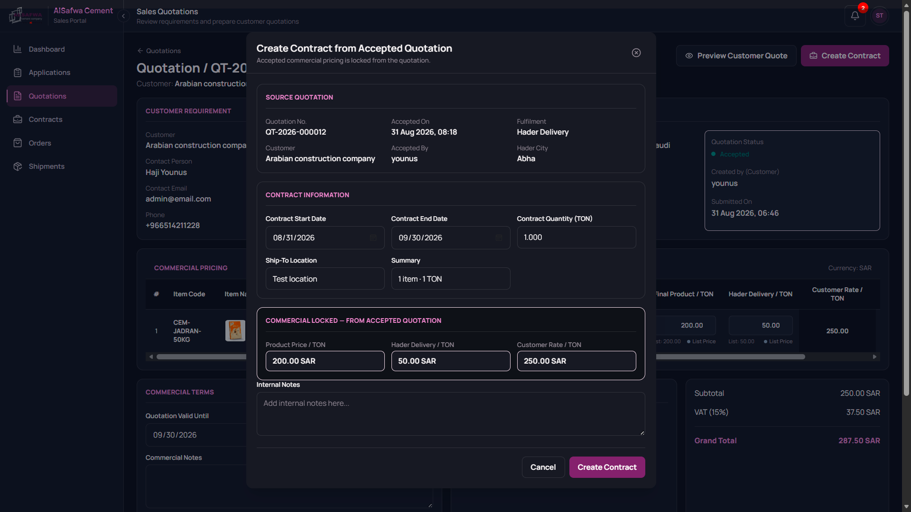
  <figcaption><strong>Figure 40:</strong> Sales Create Contract — This screen shows sales create contract in the implemented Contract workflow. Use the displayed information and available actions to complete or verify this business step.</figcaption>
</figure>

<figure id="figure-41">
  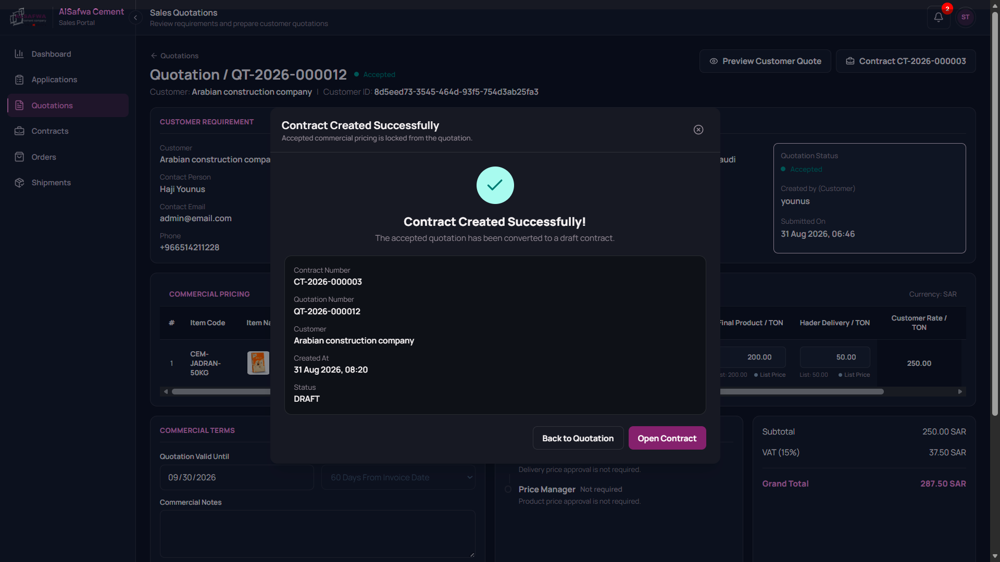
  <figcaption><strong>Figure 41:</strong> Sales Contract Created — This screen shows sales contract created in the implemented Contract workflow. Use the displayed information and available actions to complete or verify this business step.</figcaption>
</figure>

<figure id="figure-42">
  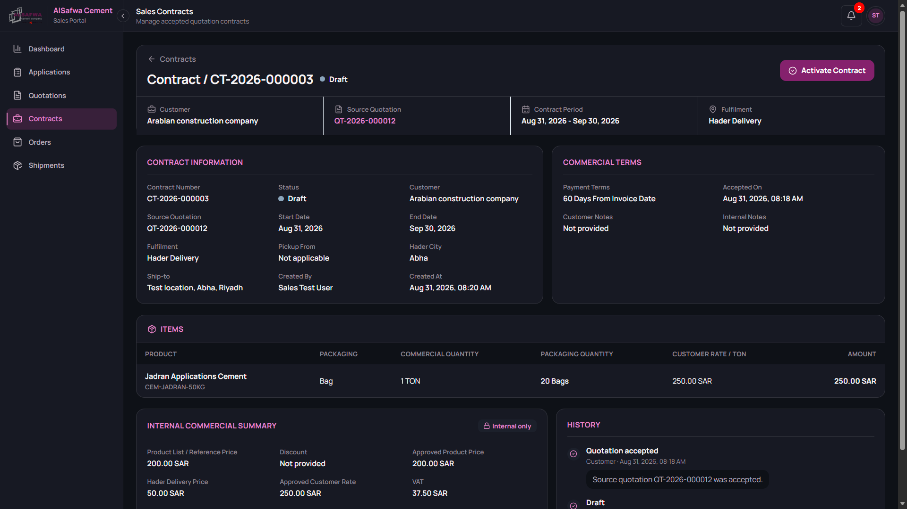
  <figcaption><strong>Figure 42:</strong> Sales Contract Details — This screen shows sales contract details in the implemented Contract workflow. Use the displayed information and available actions to complete or verify this business step.</figcaption>
</figure>

<figure id="figure-43">
  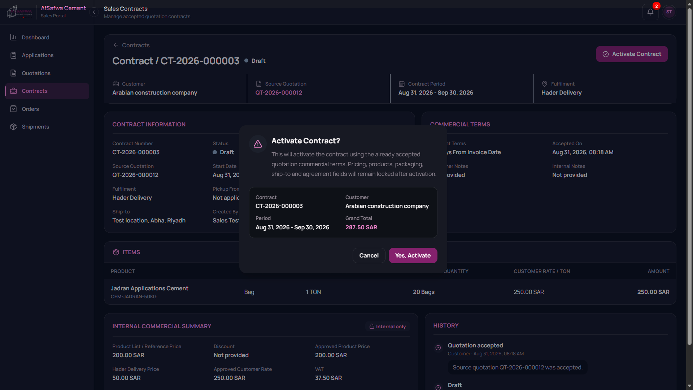
  <figcaption><strong>Figure 43:</strong> Activate Contract — This screen shows activate contract in the implemented Contract workflow. Use the displayed information and available actions to complete or verify this business step.</figcaption>
</figure>

<figure id="figure-44">
  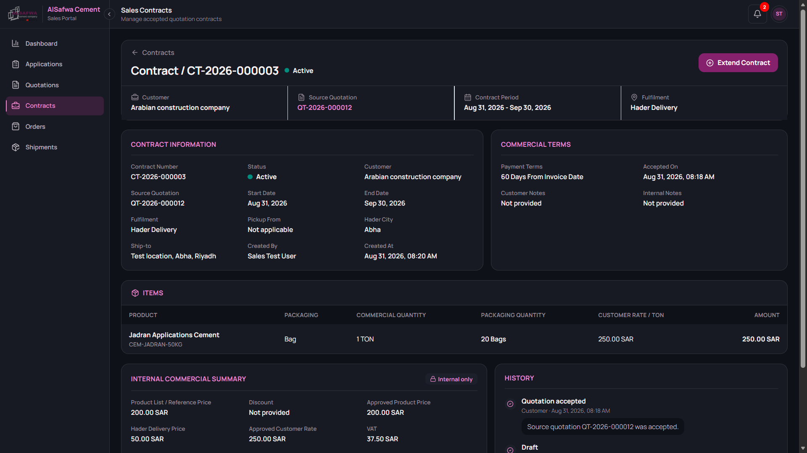
  <figcaption><strong>Figure 44:</strong> Contract Active — This screen shows contract active in the implemented Contract workflow. Use the displayed information and available actions to complete or verify this business step.</figcaption>
</figure>

<figure id="figure-45">
  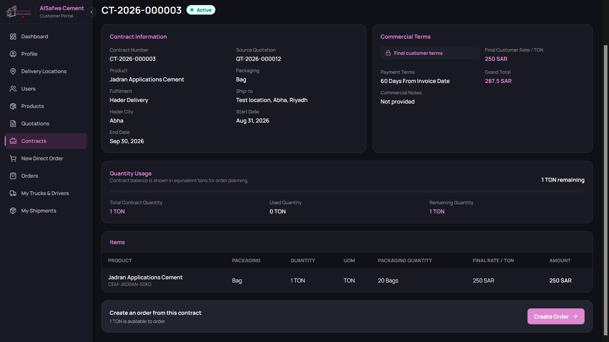
  <figcaption><strong>Figure 45:</strong> Customer Contract — This screen shows customer contract in the implemented Contract workflow. Use the displayed information and available actions to complete or verify this business step.</figcaption>
</figure>

## Orders

**Audience:** Authorized customer users and Sales Representative

Create orders from active contracts, review and submit them, monitor the customer order list, and allow Sales to begin processing submitted orders.

**Procedure**

1. Open an active contract and start an order.
2. Enter the requested quantity in TON and select the permitted fulfilment details.
3. Review and confirm the order.
4. Sales opens the submitted order and starts processing after validation.

<figure id="figure-46">
  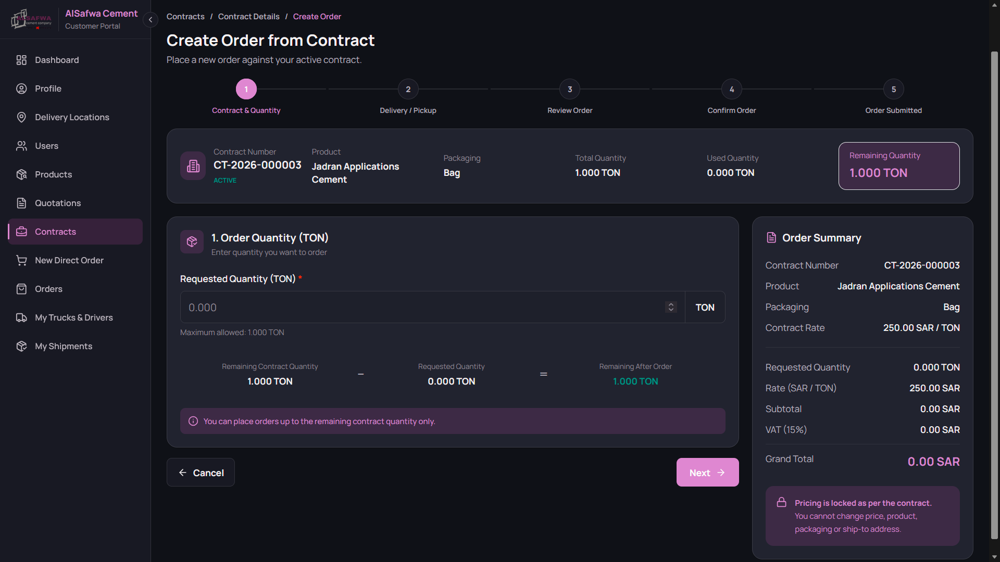
  <figcaption><strong>Figure 46:</strong> Customer Order From Contract — This screen shows customer order from contract in the implemented Orders workflow. Use the displayed information and available actions to complete or verify this business step.</figcaption>
</figure>

<figure id="figure-47">
  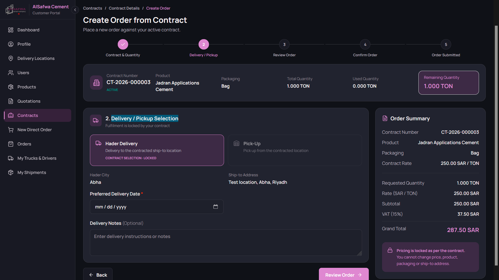
  <figcaption><strong>Figure 47:</strong> Customer Order From Contract Delivery Pick-Up Selection — This screen shows customer order from contract delivery pick-up selection in the implemented Orders workflow. Use the displayed information and available actions to complete or verify this business step.</figcaption>
</figure>

<figure id="figure-48">
  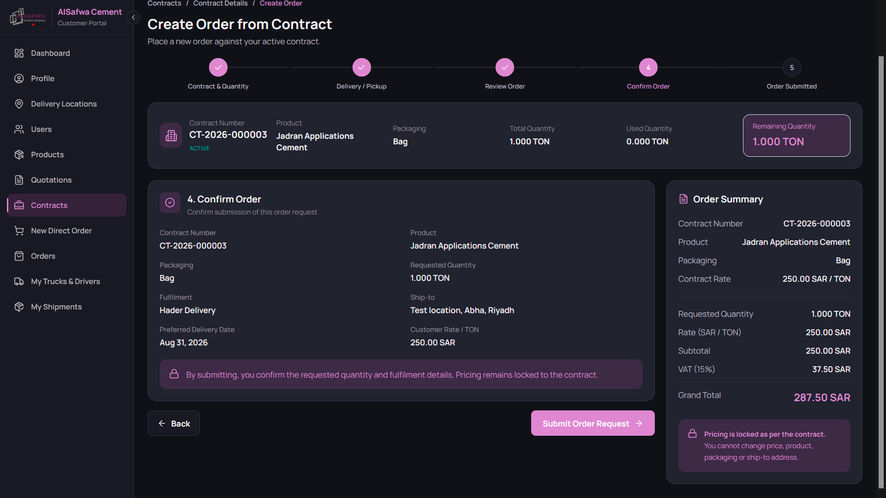
  <figcaption><strong>Figure 48:</strong> Customer Order From Contract Confirm Order — This screen shows customer order from contract confirm order in the implemented Orders workflow. Use the displayed information and available actions to complete or verify this business step.</figcaption>
</figure>

<figure id="figure-49">
  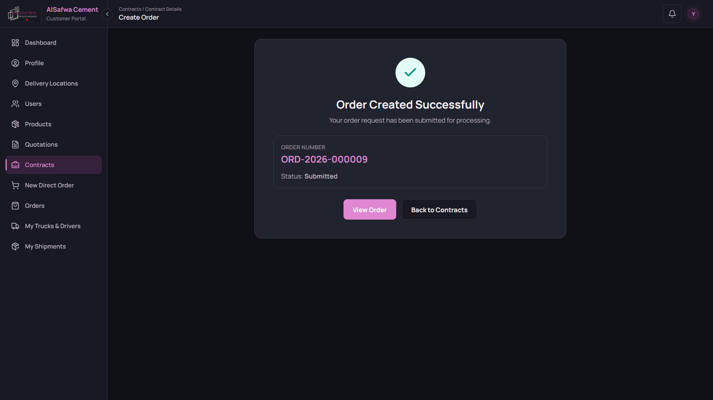
  <figcaption><strong>Figure 49:</strong> Customer Order Created — This screen shows customer order created in the implemented Orders workflow. Use the displayed information and available actions to complete or verify this business step.</figcaption>
</figure>

<figure id="figure-50">
  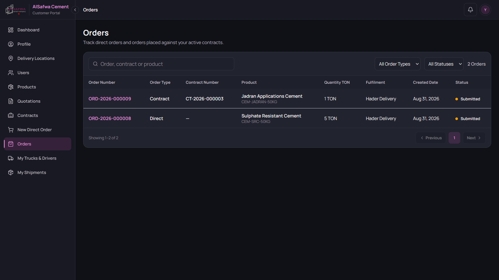
  <figcaption><strong>Figure 50:</strong> Customer Orders List — This screen shows customer orders list in the implemented Orders workflow. Use the displayed information and available actions to complete or verify this business step.</figcaption>
</figure>

<figure id="figure-51">
  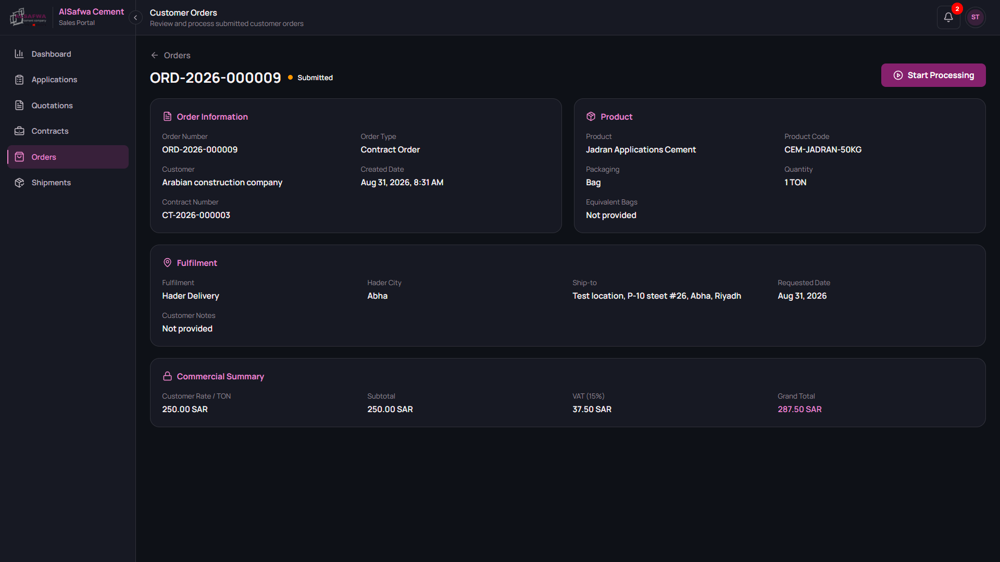
  <figcaption><strong>Figure 51:</strong> Sales Order From Contract — This screen shows sales order from contract in the implemented Orders workflow. Use the displayed information and available actions to complete or verify this business step.</figcaption>
</figure>

<figure id="figure-52">
  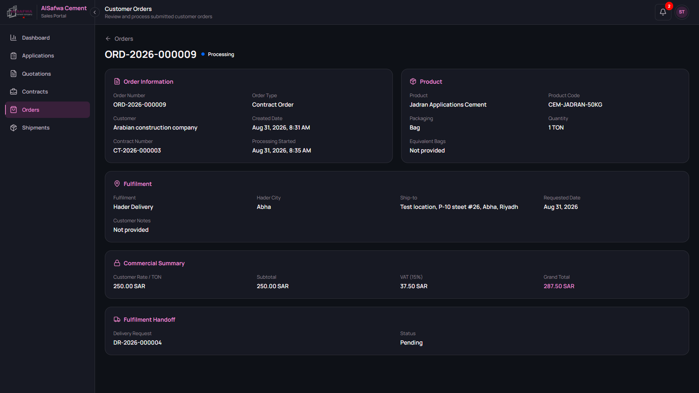
  <figcaption><strong>Figure 52:</strong> Sales Order Processing — This screen shows sales order processing in the implemented Orders workflow. Use the displayed information and available actions to complete or verify this business step.</figcaption>
</figure>

## Hader Delivery

**Audience:** Hader Manager and authorized Hader operational users

Convert processing delivery orders into delivery requests and shipments, schedule resources, load the shipment, and dispatch it into the delivery workflow.

**Procedure**

1. Open the delivery request and create the shipment.
2. Assign dispatch resources and schedule the shipment.
3. Use Loading Control to assign a compatible loading point and complete loading.
4. Dispatch the loaded shipment; dispatch does not mark it delivered.

<figure id="figure-53">
  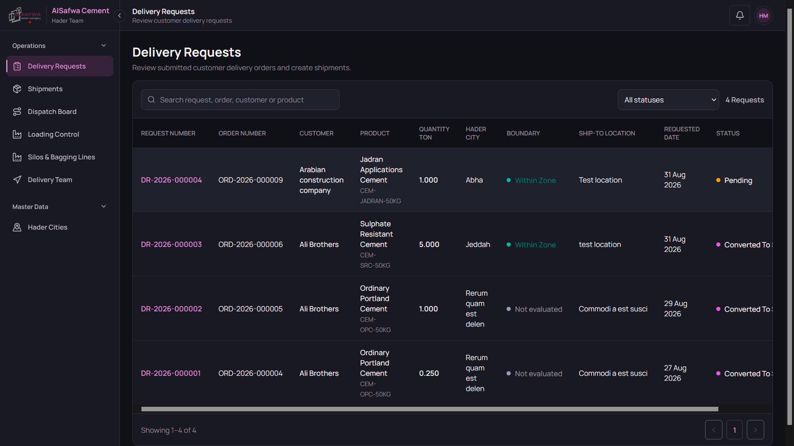
  <figcaption><strong>Figure 53:</strong> Hader Delivery Requests — This screen shows hader delivery requests in the implemented Hader Delivery workflow. Use the displayed information and available actions to complete or verify this business step.</figcaption>
</figure>

<figure id="figure-54">
  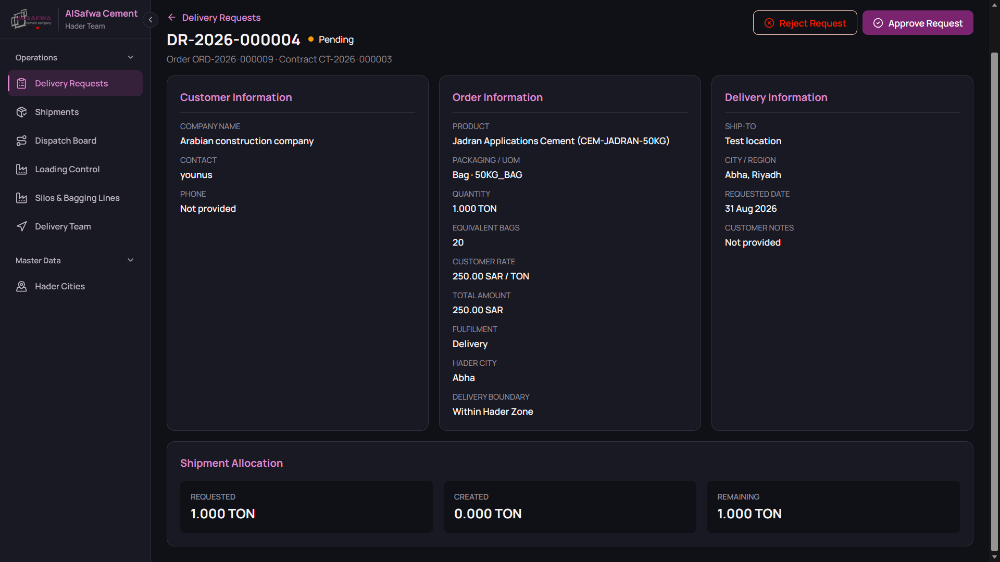
  <figcaption><strong>Figure 54:</strong> Hader Delivery Request Details — This screen shows hader delivery request details in the implemented Hader Delivery workflow. Use the displayed information and available actions to complete or verify this business step.</figcaption>
</figure>

<figure id="figure-55">
  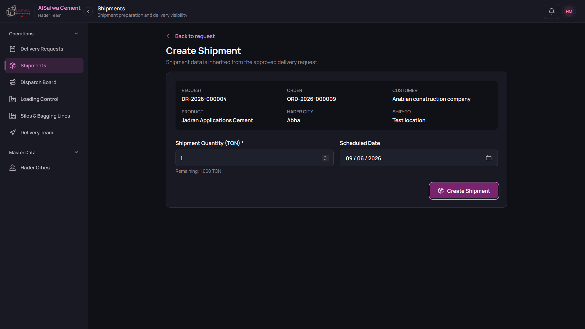
  <figcaption><strong>Figure 55:</strong> Hader Create Shipment — This screen shows hader create shipment in the implemented Hader Delivery workflow. Use the displayed information and available actions to complete or verify this business step.</figcaption>
</figure>

<figure id="figure-56">
  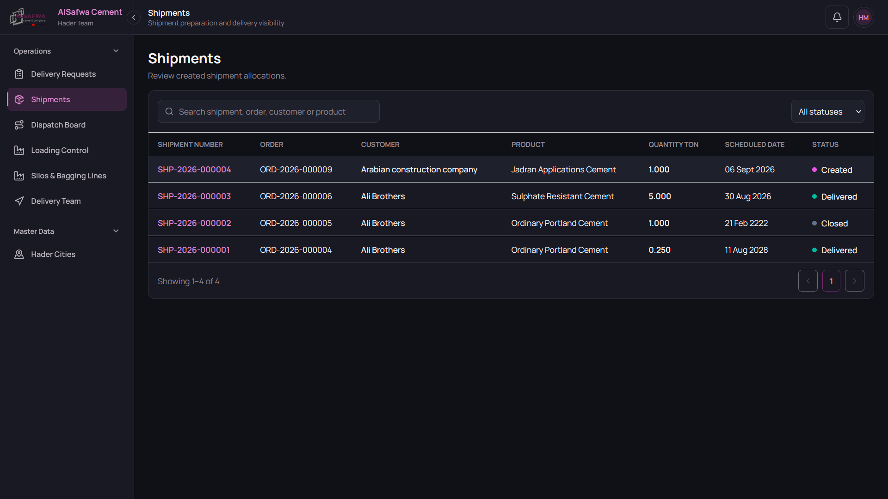
  <figcaption><strong>Figure 56:</strong> Hader Shipment Created — This screen shows hader shipment created in the implemented Hader Delivery workflow. Use the displayed information and available actions to complete or verify this business step.</figcaption>
</figure>

<figure id="figure-57">
  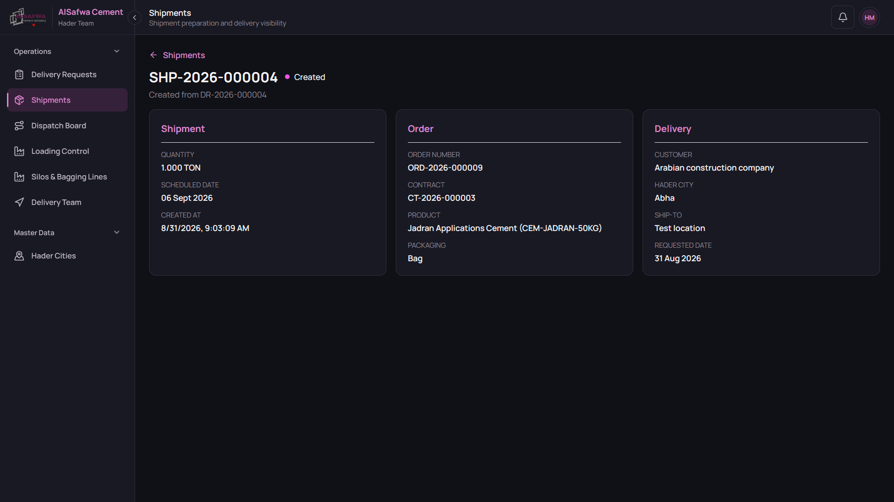
  <figcaption><strong>Figure 57:</strong> Hader Shipment Details — This screen shows hader shipment details in the implemented Hader Delivery workflow. Use the displayed information and available actions to complete or verify this business step.</figcaption>
</figure>

<figure id="figure-58">
  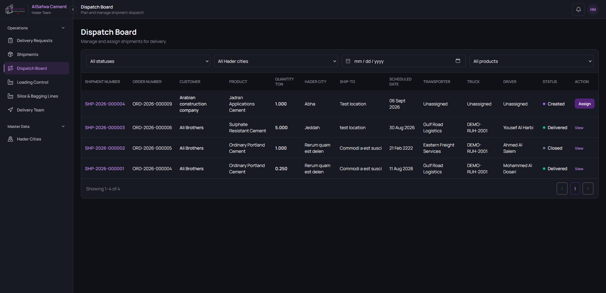
  <figcaption><strong>Figure 58:</strong> Hader Dispatch Board — This screen shows hader dispatch board in the implemented Hader Delivery workflow. Use the displayed information and available actions to complete or verify this business step.</figcaption>
</figure>

<figure id="figure-59">
  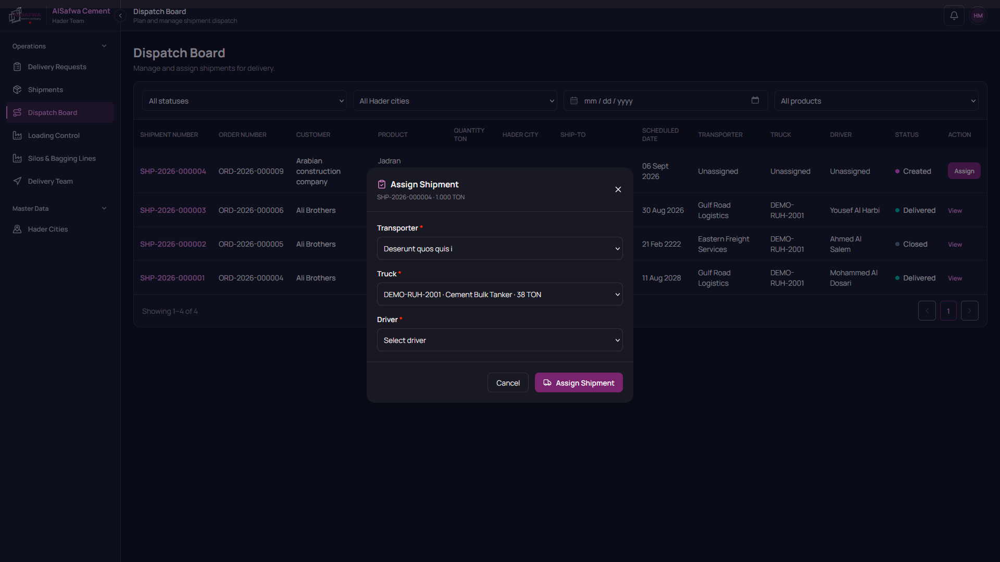
  <figcaption><strong>Figure 59:</strong> Hader Assignment — This screen shows hader assignment in the implemented Hader Delivery workflow. Use the displayed information and available actions to complete or verify this business step.</figcaption>
</figure>

<figure id="figure-60">
  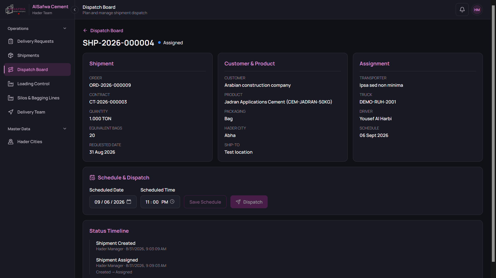
  <figcaption><strong>Figure 60:</strong> Hader Schedule Dispatch — This screen shows hader schedule dispatch in the implemented Hader Delivery workflow. Use the displayed information and available actions to complete or verify this business step.</figcaption>
</figure>

<figure id="figure-61">
  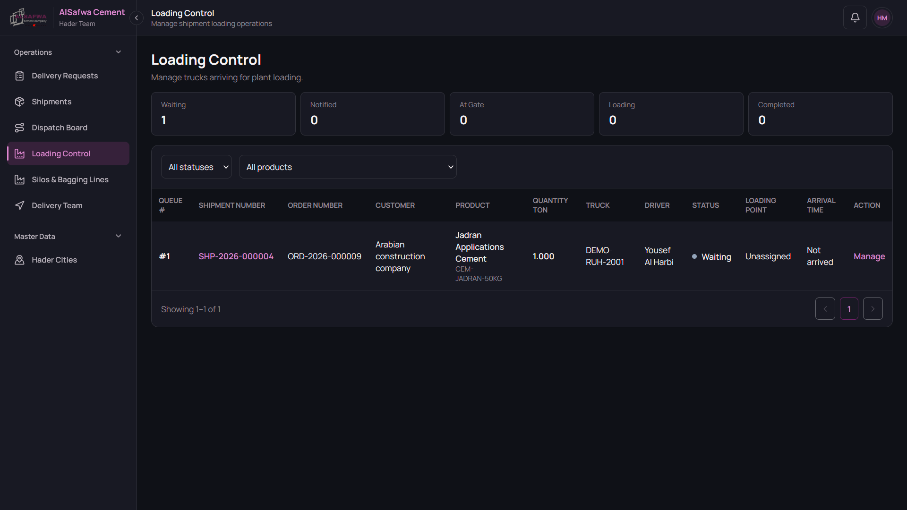
  <figcaption><strong>Figure 61:</strong> Hader Loading Control — This screen shows hader loading control in the implemented Hader Delivery workflow. Use the displayed information and available actions to complete or verify this business step.</figcaption>
</figure>

<figure id="figure-62">
  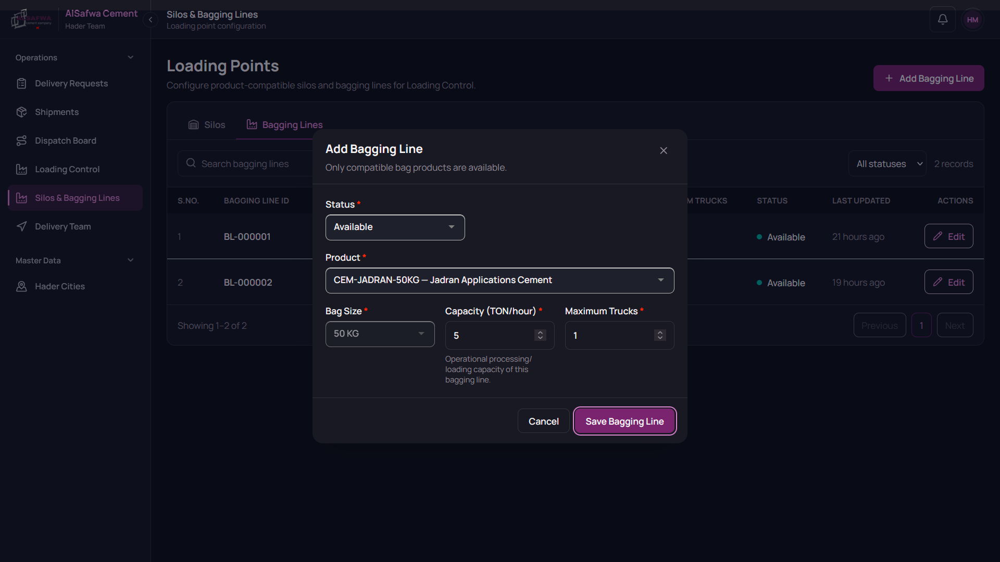
  <figcaption><strong>Figure 62:</strong> Silos And Bagging Lines Add Product — This screen shows silos and bagging lines add product in the implemented Hader Delivery workflow. Use the displayed information and available actions to complete or verify this business step.</figcaption>
</figure>

<figure id="figure-63">
  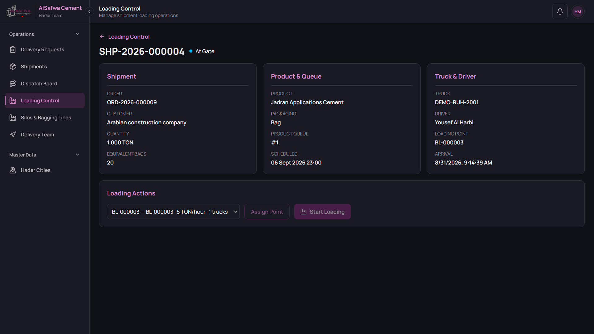
  <figcaption><strong>Figure 63:</strong> Hader Assign Start Loading — This screen shows hader assign start loading in the implemented Hader Delivery workflow. Use the displayed information and available actions to complete or verify this business step.</figcaption>
</figure>

<figure id="figure-64">
  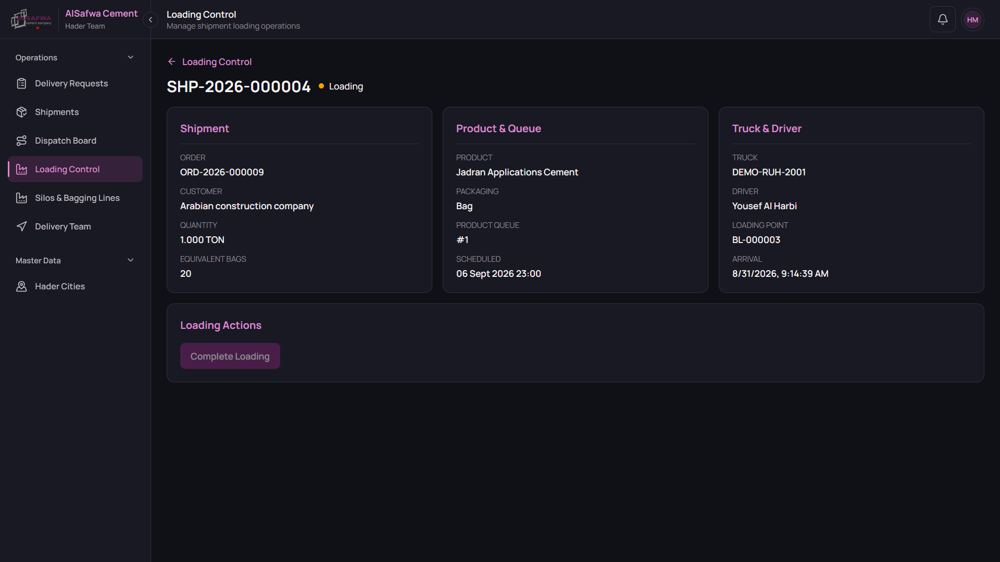
  <figcaption><strong>Figure 64:</strong> Hader Loading Complete — This screen shows hader loading complete in the implemented Hader Delivery workflow. Use the displayed information and available actions to complete or verify this business step.</figcaption>
</figure>

<figure id="figure-65">
  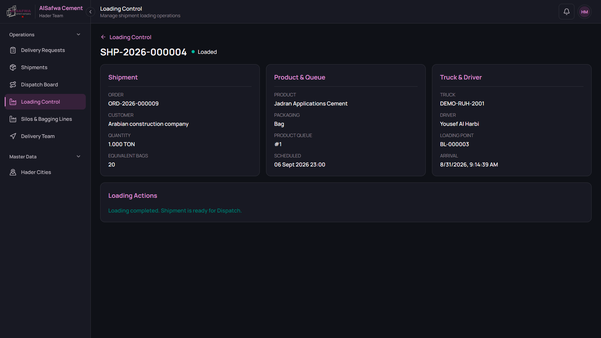
  <figcaption><strong>Figure 65:</strong> Hader Loading Completed — This screen shows hader loading completed in the implemented Hader Delivery workflow. Use the displayed information and available actions to complete or verify this business step.</figcaption>
</figure>

<figure id="figure-66">
  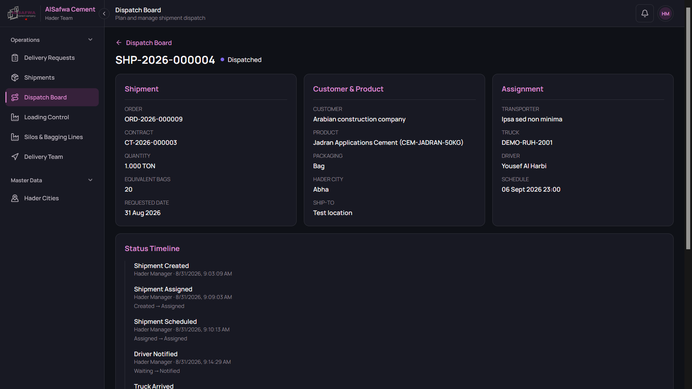
  <figcaption><strong>Figure 66:</strong> Hader Dispatched — This screen shows hader dispatched in the implemented Hader Delivery workflow. Use the displayed information and available actions to complete or verify this business step.</figcaption>
</figure>

## Proof of Delivery (POD)

**Audience:** Authorized Hader Delivery Team users

Move a dispatched shipment through in-transit and delivered states, record proof of delivery for the delivered shipment, and close the shipment after valid POD exists.

**Procedure**

1. Start delivery for a dispatched shipment.
2. Mark the in-transit shipment delivered when delivery is complete.
3. Record receiver, delivered quantity, delivery time, location, evidence, and permitted POD documents.
4. Close the shipment after POD is recorded.

<figure id="figure-67">
  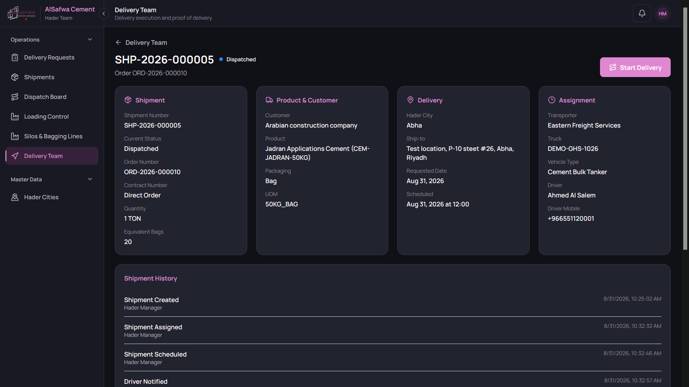
  <figcaption><strong>Figure 67:</strong> Delivery Team Start Delivery — This screen shows delivery team start delivery in the implemented Proof of Delivery (POD) workflow. Use the displayed information and available actions to complete or verify this business step.</figcaption>
</figure>

<figure id="figure-68">
  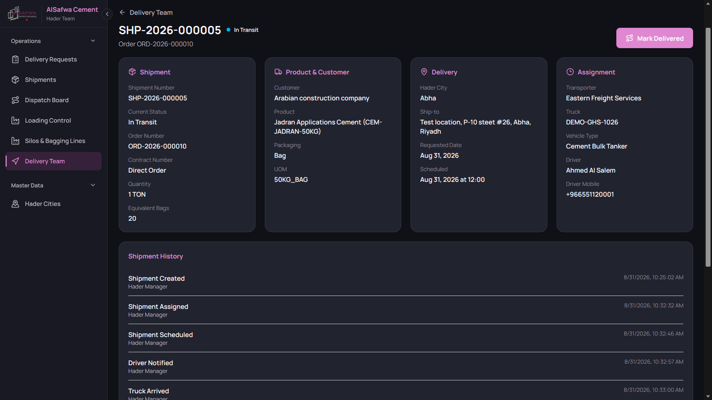
  <figcaption><strong>Figure 68:</strong> Delivery Team In Transit — This screen shows delivery team in transit in the implemented Proof of Delivery (POD) workflow. Use the displayed information and available actions to complete or verify this business step.</figcaption>
</figure>

<figure id="figure-69">
  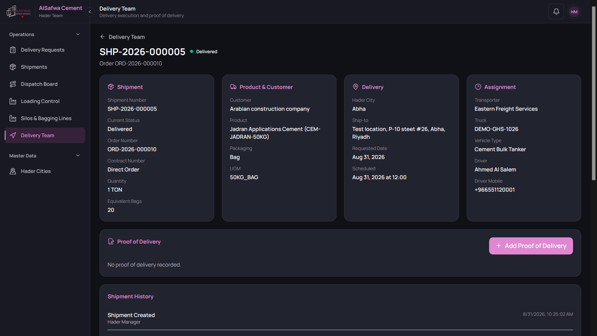
  <figcaption><strong>Figure 69:</strong> Delivery Team Mark Delivered — This screen shows delivery team mark delivered in the implemented Proof of Delivery (POD) workflow. Use the displayed information and available actions to complete or verify this business step.</figcaption>
</figure>

<figure id="figure-70">
  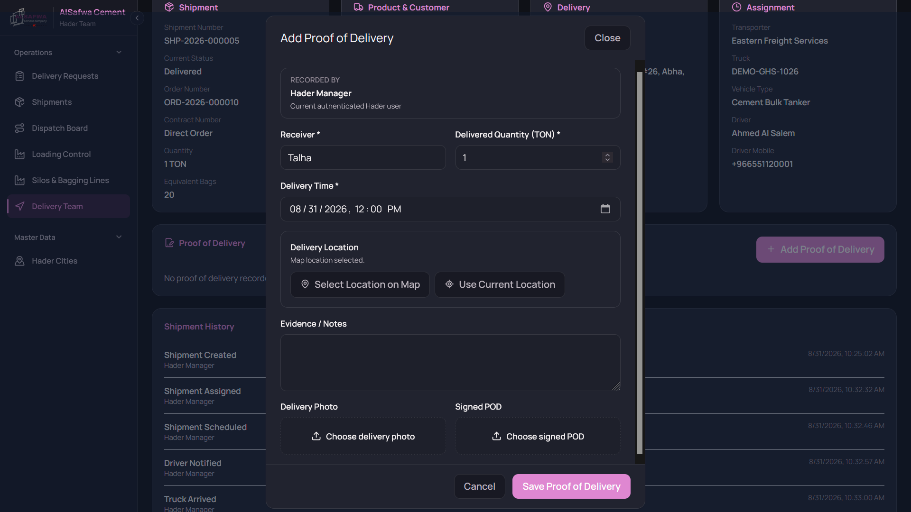
  <figcaption><strong>Figure 70:</strong> Delivery Team POD — This screen shows delivery team pod in the implemented Proof of Delivery (POD) workflow. Use the displayed information and available actions to complete or verify this business step.</figcaption>
</figure>

<figure id="figure-71">
  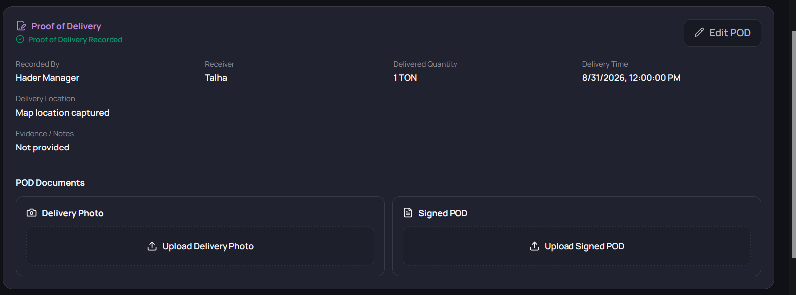
  <figcaption><strong>Figure 71:</strong> Delivery Team POD Recorded — This screen shows delivery team pod recorded in the implemented Proof of Delivery (POD) workflow. Use the displayed information and available actions to complete or verify this business step.</figcaption>
</figure>

<figure id="figure-72">
  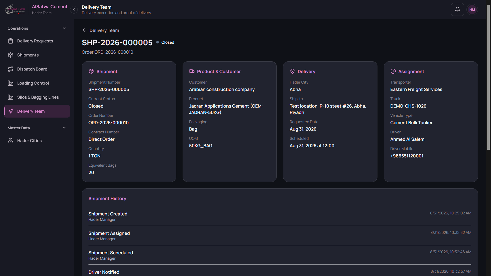
  <figcaption><strong>Figure 72:</strong> Shipment Closed — This screen shows shipment closed in the implemented Proof of Delivery (POD) workflow. Use the displayed information and available actions to complete or verify this business step.</figcaption>
</figure>

## Ship-to Variance

**Audience:** Price Manager

Review shipments delivered to a different pricing city, compare the stored ordered and actual city prices, and either dismiss the variance or raise the calculated extra charge for approval.

**Procedure**

1. Open the Ship-to Variance list and select a shipment.
2. Review the stored pricing comparison, difference per TON, and extra charge.
3. Raise a genuine positive extra charge for Commercial Director approval or dismiss it where appropriate.

<figure id="figure-73">
  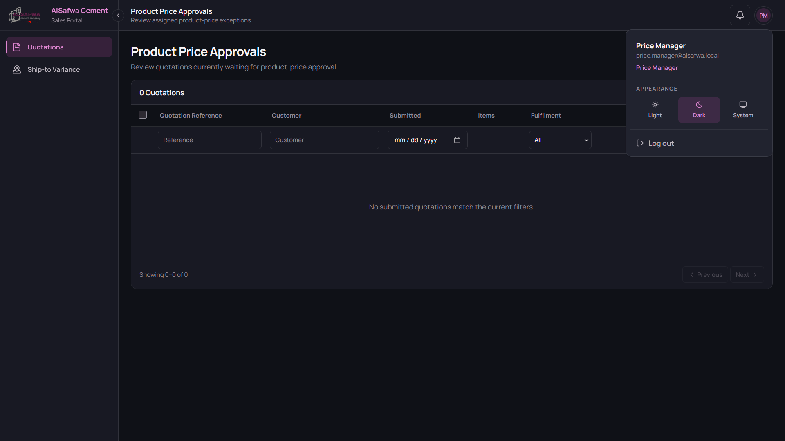
  <figcaption><strong>Figure 73:</strong> Pricing Manager Portal — This screen shows pricing manager portal in the implemented Ship-to Variance workflow. Use the displayed information and available actions to complete or verify this business step.</figcaption>
</figure>

<figure id="figure-74">
  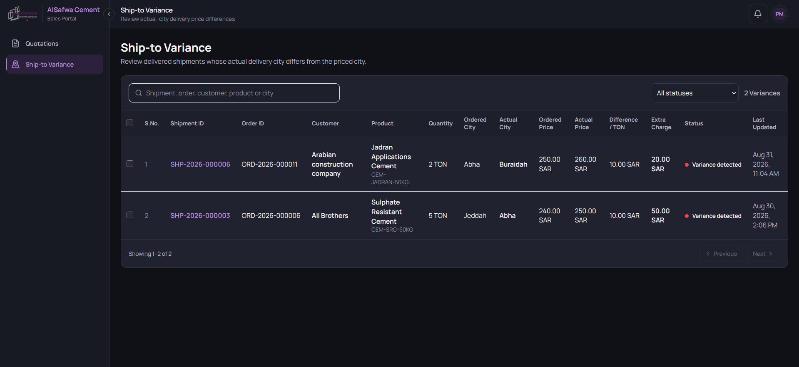
  <figcaption><strong>Figure 74:</strong> Ship-to Variance List — This screen shows ship-to variance list in the implemented Ship-to Variance workflow. Use the displayed information and available actions to complete or verify this business step.</figcaption>
</figure>

<figure id="figure-75">
  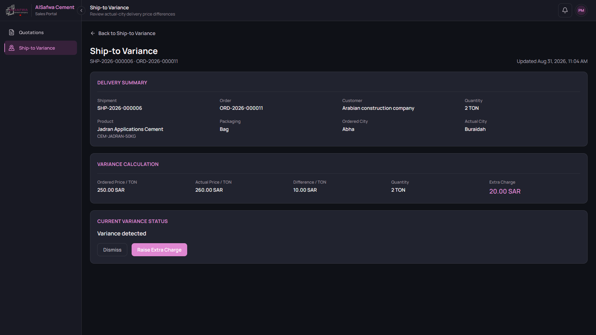
  <figcaption><strong>Figure 75:</strong> Ship-to Variance Details — This screen shows ship-to variance details in the implemented Ship-to Variance workflow. Use the displayed information and available actions to complete or verify this business step.</figcaption>
</figure>

<figure id="figure-76">
  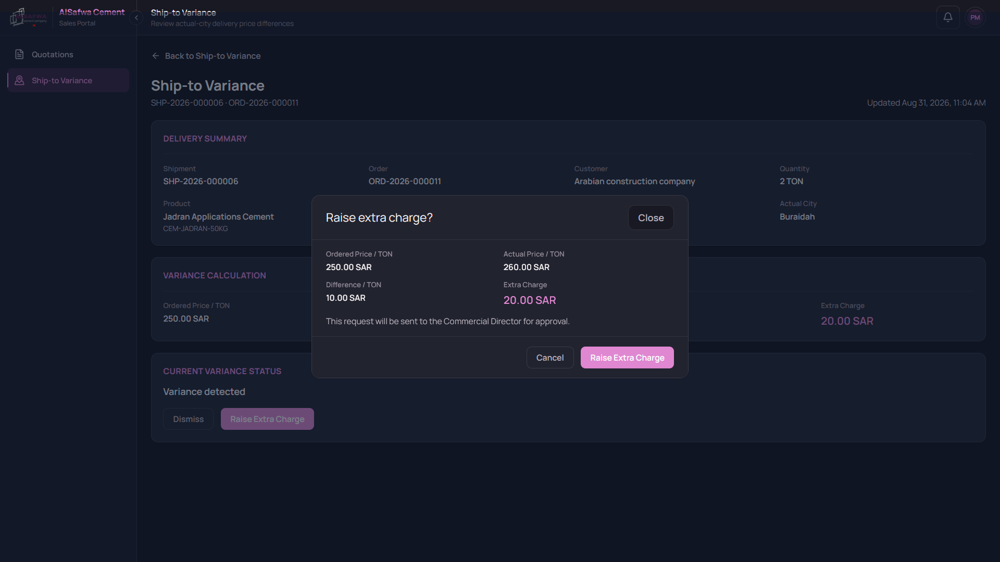
  <figcaption><strong>Figure 76:</strong> Ship-to Variance Raise Charge — This screen shows ship-to variance raise charge in the implemented Ship-to Variance workflow. Use the displayed information and available actions to complete or verify this business step.</figcaption>
</figure>

<figure id="figure-77">
  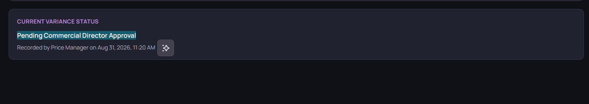
  <figcaption><strong>Figure 77:</strong> Ship-to Variance Pending Approval — This screen shows ship-to variance pending approval in the implemented Ship-to Variance workflow. Use the displayed information and available actions to complete or verify this business step.</figcaption>
</figure>

## Pricing Administrator

**Audience:** Pricing Administrator

Maintain product records, city-based product and delivery pricing, Hader city boundaries, logistics master data, pickup locations, and central VAT configuration.

**Procedure**

1. Maintain active products and their customer-visible information.
2. Configure product and delivery list prices using the established per-TON basis.
3. Maintain permitted city, fleet, pickup-location, transporter, and VAT configuration.
4. Keep internal pricing and logistics costs restricted to authorized users.

<figure id="figure-78">
  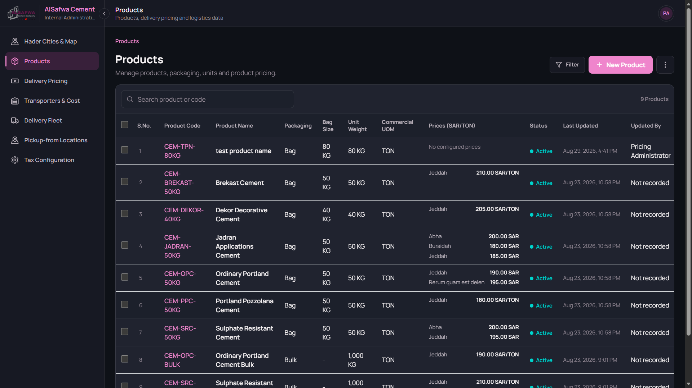
  <figcaption><strong>Figure 78:</strong> Pricing Admin Products — This screen shows pricing admin products in the implemented Pricing Administrator workflow. Use the displayed information and available actions to complete or verify this business step.</figcaption>
</figure>

<figure id="figure-79">
  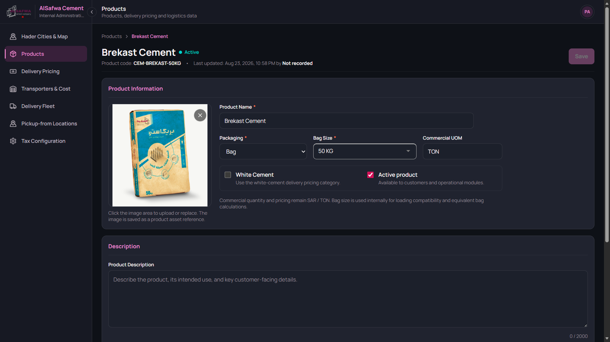
  <figcaption><strong>Figure 79:</strong> Pricing Admin Product Details — This screen shows pricing admin product details in the implemented Pricing Administrator workflow. Use the displayed information and available actions to complete or verify this business step.</figcaption>
</figure>

<figure id="figure-80">
  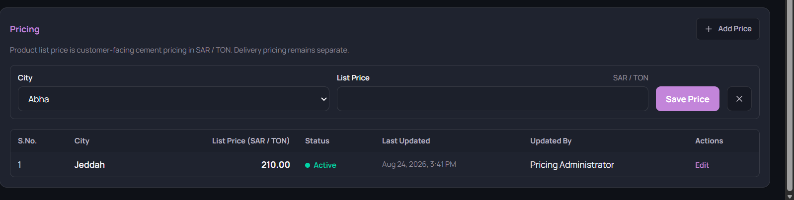
  <figcaption><strong>Figure 80:</strong> Pricing Admin Product Prices — This screen shows pricing admin product prices in the implemented Pricing Administrator workflow. Use the displayed information and available actions to complete or verify this business step.</figcaption>
</figure>

<figure id="figure-81">
  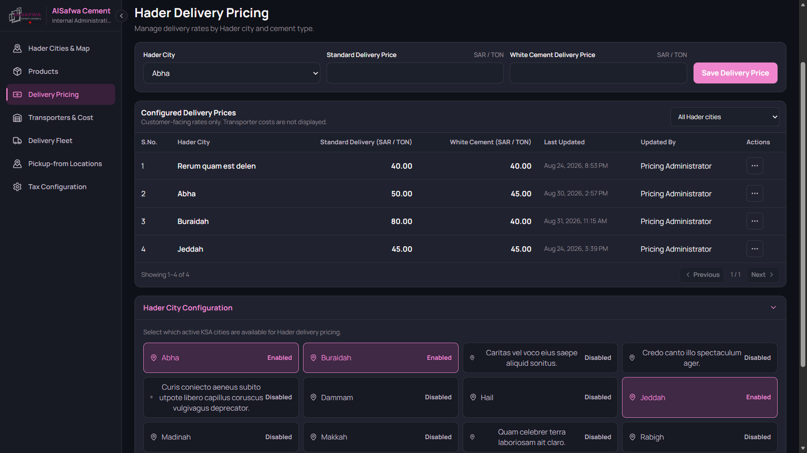
  <figcaption><strong>Figure 81:</strong> Pricing Admin Delivery Pricing — This screen shows pricing admin delivery pricing in the implemented Pricing Administrator workflow. Use the displayed information and available actions to complete or verify this business step.</figcaption>
</figure>

<figure id="figure-82">
  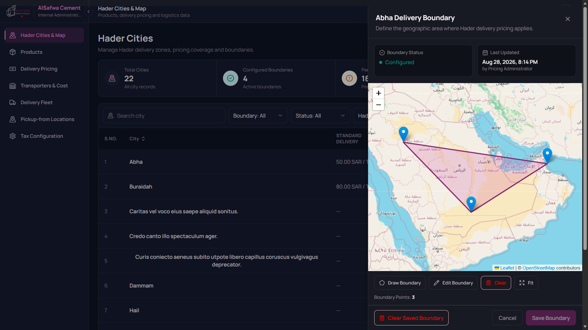
  <figcaption><strong>Figure 82:</strong> Pricing Admin Hader Cities Map — This screen shows pricing admin hader cities map in the implemented Pricing Administrator workflow. Use the displayed information and available actions to complete or verify this business step.</figcaption>
</figure>

<figure id="figure-83">
  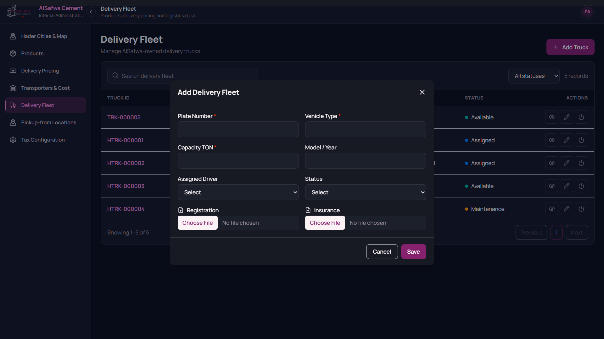
  <figcaption><strong>Figure 83:</strong> Pricing Admin Delivery Fleet — This screen shows pricing admin delivery fleet in the implemented Pricing Administrator workflow. Use the displayed information and available actions to complete or verify this business step.</figcaption>
</figure>

<figure id="figure-84">
  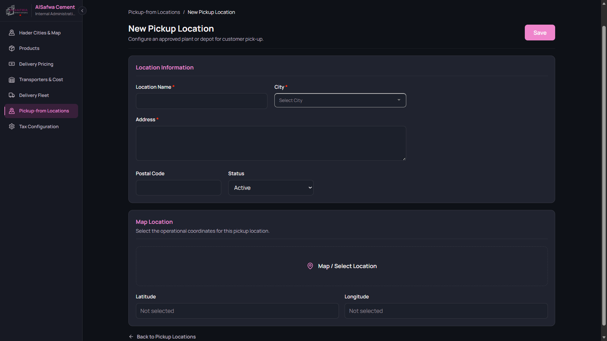
  <figcaption><strong>Figure 84:</strong> Pricing Admin Pick-Up Locations — This screen shows pricing admin pick-up locations in the implemented Pricing Administrator workflow. Use the displayed information and available actions to complete or verify this business step.</figcaption>
</figure>

<figure id="figure-85">
  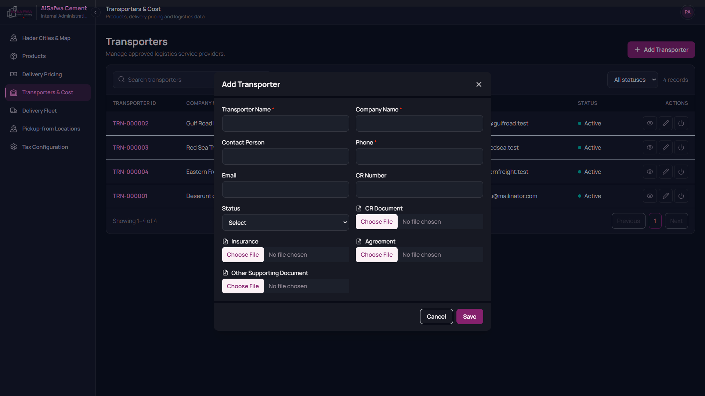
  <figcaption><strong>Figure 85:</strong> Pricing Admin Transporters — This screen shows pricing admin transporters in the implemented Pricing Administrator workflow. Use the displayed information and available actions to complete or verify this business step.</figcaption>
</figure>

<figure id="figure-86">
  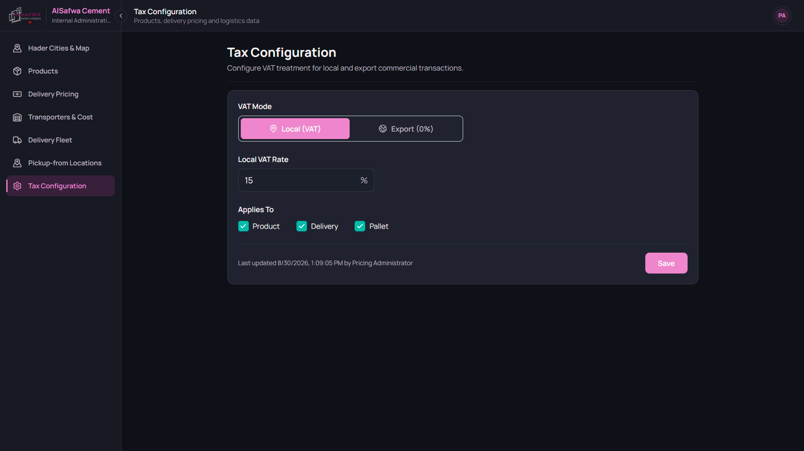
  <figcaption><strong>Figure 86:</strong> Pricing Admin Tax Configuration — This screen shows pricing admin tax configuration in the implemented Pricing Administrator workflow. Use the displayed information and available actions to complete or verify this business step.</figcaption>
</figure>

## Commercial Director

**Audience:** Commercial Director

Review pending Ship-to Variance extra-charge requests and approve or reject them without altering the historical variance calculation.

**Procedure**

1. Open the pending variance approvals queue.
2. Review the shipment, order, city-price comparison, and calculated charge.
3. Approve the request or reject it with the required reason.

<figure id="figure-87">
  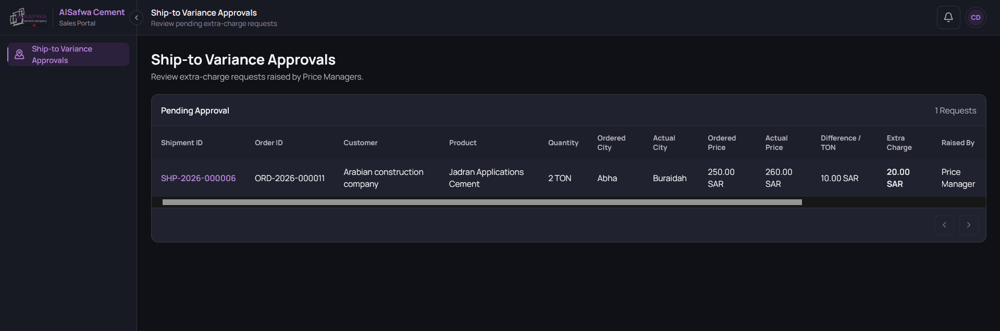
  <figcaption><strong>Figure 87:</strong> Commercial Director Variance Approvals — This screen shows commercial director variance approvals in the implemented Commercial Director workflow. Use the displayed information and available actions to complete or verify this business step.</figcaption>
</figure>

<figure id="figure-88">
  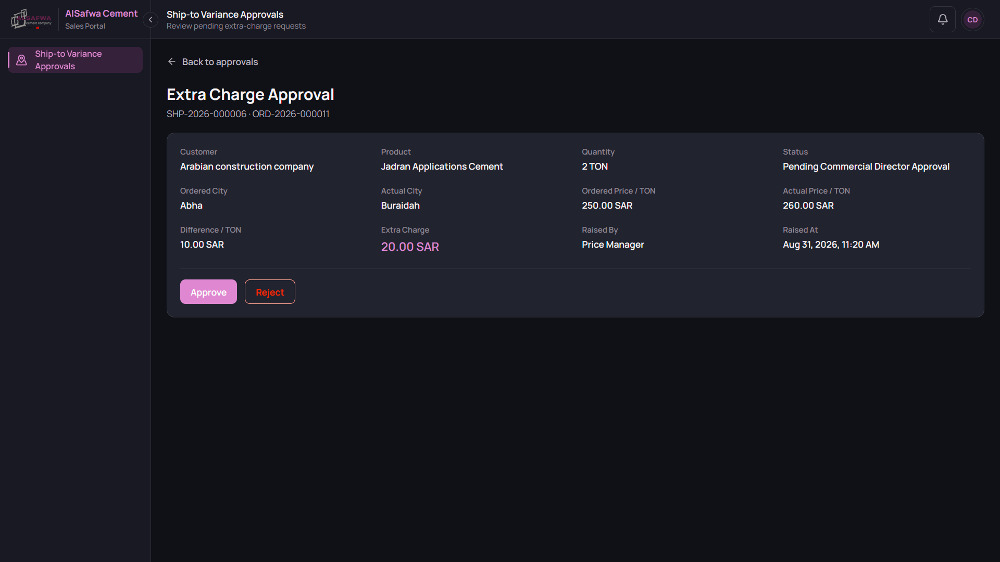
  <figcaption><strong>Figure 88:</strong> Commercial Director Variance Details — This screen shows commercial director variance details in the implemented Commercial Director workflow. Use the displayed information and available actions to complete or verify this business step.</figcaption>
</figure>

<figure id="figure-89">
  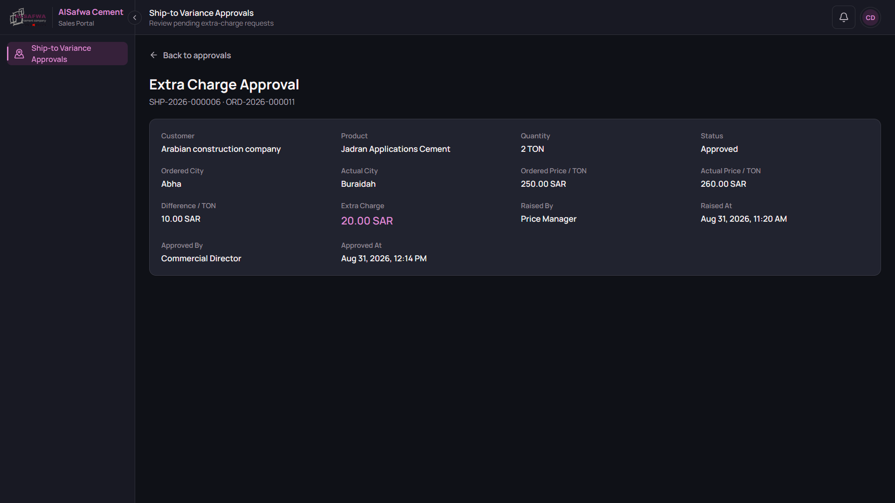
  <figcaption><strong>Figure 89:</strong> Commercial Director Approved — This screen shows commercial director approved in the implemented Commercial Director workflow. Use the displayed information and available actions to complete or verify this business step.</figcaption>
</figure>

## Portal Administrator

**Audience:** Portal Administrator and Customer Administrator for their respective user-management screens

Portal Administrators manage internal users through the protected administration area. Customer Administrators separately create and manage other users belonging to their own customer account.

**Procedure**

1. Portal Administrator signs in through the dedicated administration login.
2. Create or maintain internal users with the existing roles and active status.
3. Customer Administrator uses Customer Portal User Management for other users in the same account.
4. Use Profile, not the Users list, for the currently authenticated customer user's own account.

<figure id="figure-90">
  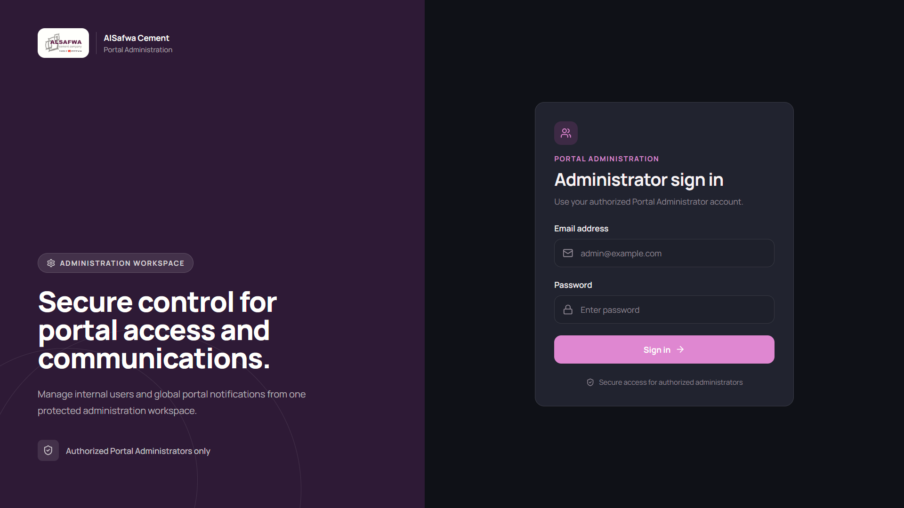
  <figcaption><strong>Figure 90:</strong> Portal Admin Login — This screen shows portal admin login in the implemented Portal Administrator workflow. Use the displayed information and available actions to complete or verify this business step.</figcaption>
</figure>

<figure id="figure-91">
  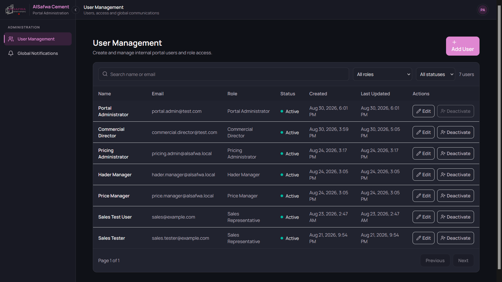
  <figcaption><strong>Figure 91:</strong> Portal Admin User Management — This screen shows portal admin user management in the implemented Portal Administrator workflow. Use the displayed information and available actions to complete or verify this business step.</figcaption>
</figure>

<figure id="figure-92">
  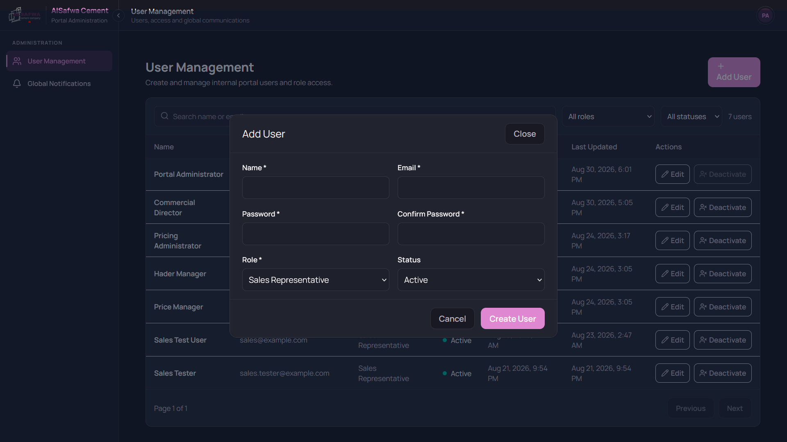
  <figcaption><strong>Figure 92:</strong> Portal Admin Create User — This screen shows portal admin create user in the implemented Portal Administrator workflow. Use the displayed information and available actions to complete or verify this business step.</figcaption>
</figure>

<figure id="figure-93">
  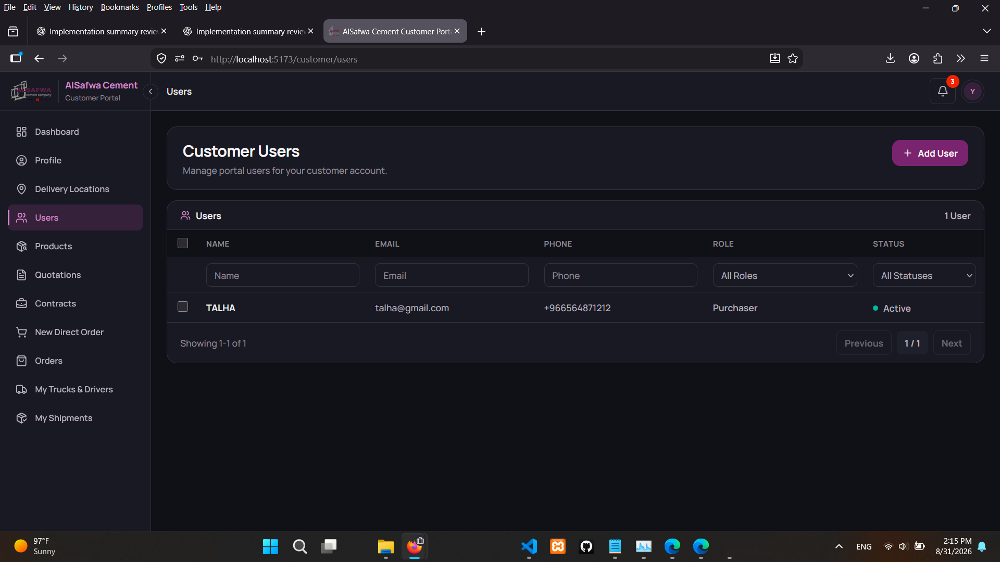
  <figcaption><strong>Figure 93:</strong> Customer User Management — This screen shows customer user management in the implemented Portal Administrator workflow. Use the displayed information and available actions to complete or verify this business step.</figcaption>
</figure>

<figure id="figure-94">
  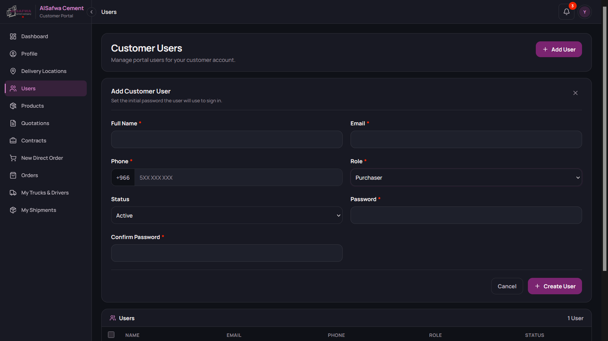
  <figcaption><strong>Figure 94:</strong> Customer Create User — This screen shows customer create user in the implemented Portal Administrator workflow. Use the displayed information and available actions to complete or verify this business step.</figcaption>
</figure>

<figure id="figure-95">
  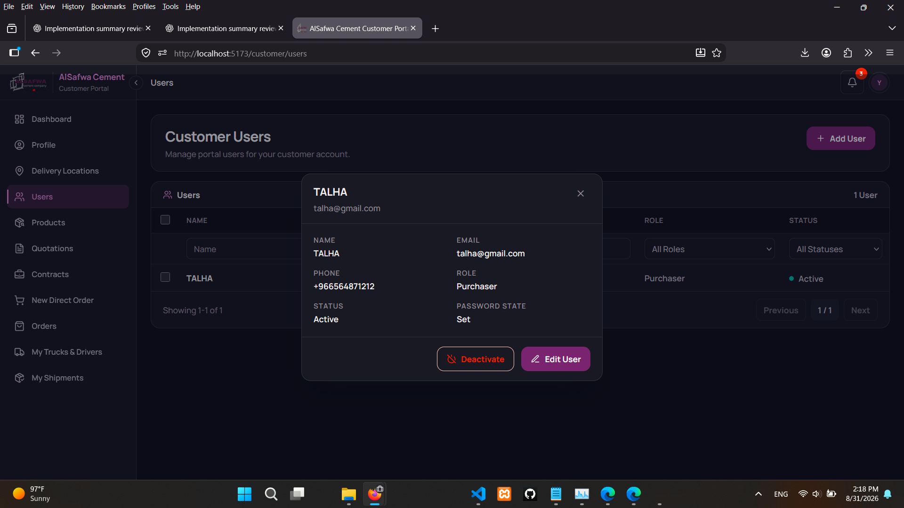
  <figcaption><strong>Figure 95:</strong> Customer Edit User — This screen shows customer edit user in the implemented Portal Administrator workflow. Use the displayed information and available actions to complete or verify this business step.</figcaption>
</figure>

## End-to-End Workflow

1. A prospective customer submits an organization registration.
2. Sales reviews the application, approves it, and activates the customer account.
3. An authorized customer requests a quotation or submits a direct order.
4. Sales reviews quotation pricing; required pricing approvals are completed before the customer decision.
5. An accepted quotation can be converted into an active contract, and customers can order against remaining contract TON.
6. Sales starts order processing, creating the Hader delivery request for delivery fulfilment.
7. Hader creates, assigns, loads, and dispatches the shipment.
8. Delivery Team starts delivery, marks it delivered, records POD, and closes the shipment.
9. If the actual pricing city differs, Price Manager raises the calculated Ship-to Variance charge for Commercial Director approval.

## UAT Testing Guide

Execute each case using an authorized account. Record the observed result and set Status to PASS, FAIL, BLOCKED, or NOT TESTED. Screenshot evidence demonstrates implemented screens but does not by itself claim that a UAT case passed.

| Test ID | Role | Module | Scenario | Expected Result | Actual Result | Status | Comments |
| --- | --- | --- | --- | --- | --- | --- | --- |
| UAT-REG-001 | Prospective Customer | Customer Registration | Complete and submit an organization registration. | A valid application reference is created and the application is submitted for Sales review. | _To be completed during UAT_ | NOT TESTED |  |
| UAT-REG-002 | Sales Representative | Customer Registration | Review, approve, and activate a submitted registration. | The approved customer account is activated through the authorized Sales workflow. | _To be completed during UAT_ | NOT TESTED |  |
| UAT-CUS-001 | Customer User | Login & Access | Sign in through the shared Customer Portal login. | The authenticated user reaches the Customer Portal and sees role-permitted navigation. | _To be completed during UAT_ | NOT TESTED |  |
| UAT-CUS-002 | Authorized Customer User | Products | Browse products and open product details. | Only active customer-visible product information and permitted prices are displayed. | _To be completed during UAT_ | NOT TESTED |  |
| UAT-QUO-001 | Customer Administrator / Purchaser | Quotations | Create and submit a quotation request. | The quotation is created with selected products and enters Pending Sales Review. | _To be completed during UAT_ | NOT TESTED |  |
| UAT-ORD-001 | Customer Administrator / Purchaser | Direct Orders | Create, review, and submit a direct order. | The order is created with TON-based quantity, configured VAT, and Submitted status. | _To be completed during UAT_ | NOT TESTED |  |
| UAT-LOC-001 | Customer Administrator / Purchaser | Delivery Locations | Save a Ship-to location with a valid map position. | Coordinates persist and the location can be used in delivery orders. | _To be completed during UAT_ | NOT TESTED |  |
| UAT-SAL-001 | Sales Representative | Applications | Open the Sales applications list and review an application. | The selected customer application opens with its submitted details. | _To be completed during UAT_ | NOT TESTED |  |
| UAT-SAL-002 | Sales Representative | Quotation Review | Review and price a customer quotation. | Configured list prices load and the quotation follows the required commercial approval path. | _To be completed during UAT_ | NOT TESTED |  |
| UAT-CUS-003 | Customer Administrator / Purchaser | Quotation Decision | Review and accept a quotation ready for the customer. | The quotation status becomes Accepted and internal pricing components remain hidden. | _To be completed during UAT_ | NOT TESTED |  |
| UAT-CON-001 | Sales Representative | Contracts | Create a contract from an accepted quotation. | One draft contract is created with a locked accepted commercial snapshot. | _To be completed during UAT_ | NOT TESTED |  |
| UAT-CON-002 | Sales Representative | Contracts | Activate a valid draft contract. | The contract becomes Active without repeating quotation pricing approval. | _To be completed during UAT_ | NOT TESTED |  |
| UAT-CON-003 | Customer User | Contracts | View an active customer contract. | The customer sees only its own active contract and combined customer-facing commercial rate. | _To be completed during UAT_ | NOT TESTED |  |
| UAT-ORD-002 | Customer Administrator / Purchaser | Contract Orders | Create and submit an order from an active contract. | The order is submitted and remaining contract TON is validated and updated transactionally. | _To be completed during UAT_ | NOT TESTED |  |
| UAT-ORD-003 | Sales Representative | Sales Orders | Start processing a valid submitted order. | Order status changes from Submitted to Processing and the action is recorded. | _To be completed during UAT_ | NOT TESTED |  |
| UAT-HAD-001 | Hader Manager | Delivery Requests | Create a shipment from a valid delivery request. | A shipment is created using the existing order and delivery data. | _To be completed during UAT_ | NOT TESTED |  |
| UAT-HAD-002 | Hader Manager | Dispatch | Assign resources, schedule, and dispatch a loaded shipment. | The shipment becomes Dispatched and is ready for Delivery Team action; it is not marked Delivered. | _To be completed during UAT_ | NOT TESTED |  |
| UAT-HAD-003 | Hader Manager | Loading Control | Assign a compatible loading point and complete loading. | Loading completes using compatible silo or bagging-line capacity without treating capacity as stock. | _To be completed during UAT_ | NOT TESTED |  |
| UAT-POD-001 | Delivery Team | Delivery | Start delivery and mark an in-transit shipment delivered. | The shipment moves through Dispatched, In Transit, and Delivered using authorized actions. | _To be completed during UAT_ | NOT TESTED |  |
| UAT-POD-002 | Delivery Team | Proof of Delivery | Record POD and close a delivered shipment. | POD is stored once for the shipment and the shipment can then be closed. | _To be completed during UAT_ | NOT TESTED |  |
| UAT-VAR-001 | Price Manager | Ship-to Variance | Raise a positive calculated extra charge. | The stored variance snapshot enters Pending Commercial Director Approval without changing original order pricing. | _To be completed during UAT_ | NOT TESTED |  |
| UAT-PRC-001 | Pricing Administrator | Products & Pricing | Maintain product and city-based product prices. | The active product and authoritative per-TON city prices are saved and available to pricing lookups. | _To be completed during UAT_ | NOT TESTED |  |
| UAT-PRC-002 | Pricing Administrator | Delivery Pricing | Maintain city delivery prices and boundaries. | Configured standard and white-cement delivery prices and city boundaries are available to authorized workflows. | _To be completed during UAT_ | NOT TESTED |  |
| UAT-PRC-003 | Pricing Administrator | Administration | Maintain logistics master data, pickup locations, and VAT configuration. | Valid configuration saves through authorized administration APIs. | _To be completed during UAT_ | NOT TESTED |  |
| UAT-COM-001 | Commercial Director | Variance Approval | Approve a pending Ship-to Variance extra charge. | The request becomes Approved with authenticated approver and timestamp; downstream financial posting remains pending. | _To be completed during UAT_ | NOT TESTED |  |
| UAT-ADM-001 | Portal Administrator | User Management | Create and maintain an internal portal user. | The user is created with a hashed password, assigned role, and active status without exposing credentials. | _To be completed during UAT_ | NOT TESTED |  |
| UAT-CUA-001 | Customer Administrator | Customer Users | Create and edit another user in the same customer account. | The user is tenant-scoped, securely created, and manageable without exposing the authenticated administrator in the Users list. | _To be completed during UAT_ | NOT TESTED |  |

## UAT Testing Checklist

| Test ID | Module | Scenario | Tester | Date | Status | Comments |
| --- | --- | --- | --- | --- | --- | --- |
| UAT-REG-001 | Customer Registration | Complete and submit an organization registration. |  |  | NOT TESTED |  |
| UAT-REG-002 | Customer Registration | Review, approve, and activate a submitted registration. |  |  | NOT TESTED |  |
| UAT-CUS-001 | Login & Access | Sign in through the shared Customer Portal login. |  |  | NOT TESTED |  |
| UAT-CUS-002 | Products | Browse products and open product details. |  |  | NOT TESTED |  |
| UAT-QUO-001 | Quotations | Create and submit a quotation request. |  |  | NOT TESTED |  |
| UAT-ORD-001 | Direct Orders | Create, review, and submit a direct order. |  |  | NOT TESTED |  |
| UAT-LOC-001 | Delivery Locations | Save a Ship-to location with a valid map position. |  |  | NOT TESTED |  |
| UAT-SAL-001 | Applications | Open the Sales applications list and review an application. |  |  | NOT TESTED |  |
| UAT-SAL-002 | Quotation Review | Review and price a customer quotation. |  |  | NOT TESTED |  |
| UAT-CUS-003 | Quotation Decision | Review and accept a quotation ready for the customer. |  |  | NOT TESTED |  |
| UAT-CON-001 | Contracts | Create a contract from an accepted quotation. |  |  | NOT TESTED |  |
| UAT-CON-002 | Contracts | Activate a valid draft contract. |  |  | NOT TESTED |  |
| UAT-CON-003 | Contracts | View an active customer contract. |  |  | NOT TESTED |  |
| UAT-ORD-002 | Contract Orders | Create and submit an order from an active contract. |  |  | NOT TESTED |  |
| UAT-ORD-003 | Sales Orders | Start processing a valid submitted order. |  |  | NOT TESTED |  |
| UAT-HAD-001 | Delivery Requests | Create a shipment from a valid delivery request. |  |  | NOT TESTED |  |
| UAT-HAD-002 | Dispatch | Assign resources, schedule, and dispatch a loaded shipment. |  |  | NOT TESTED |  |
| UAT-HAD-003 | Loading Control | Assign a compatible loading point and complete loading. |  |  | NOT TESTED |  |
| UAT-POD-001 | Delivery | Start delivery and mark an in-transit shipment delivered. |  |  | NOT TESTED |  |
| UAT-POD-002 | Proof of Delivery | Record POD and close a delivered shipment. |  |  | NOT TESTED |  |
| UAT-VAR-001 | Ship-to Variance | Raise a positive calculated extra charge. |  |  | NOT TESTED |  |
| UAT-PRC-001 | Products & Pricing | Maintain product and city-based product prices. |  |  | NOT TESTED |  |
| UAT-PRC-002 | Delivery Pricing | Maintain city delivery prices and boundaries. |  |  | NOT TESTED |  |
| UAT-PRC-003 | Administration | Maintain logistics master data, pickup locations, and VAT configuration. |  |  | NOT TESTED |  |
| UAT-COM-001 | Variance Approval | Approve a pending Ship-to Variance extra charge. |  |  | NOT TESTED |  |
| UAT-ADM-001 | User Management | Create and maintain an internal portal user. |  |  | NOT TESTED |  |
| UAT-CUA-001 | Customer Users | Create and edit another user in the same customer account. |  |  | NOT TESTED |  |

## Known Limitations & Pending Features

The following functionality is pending or has not been verified as implemented. It must not be accepted during UAT as completed functionality:

- Financial posting of approved Ship-to Variance charges
- Oracle Fusion integration
- Invoices, receivables, and statements dependent on ERP integration
- VAS Cloud Logistics live outbound API transmission (mapping and outbox foundation exists, but the external endpoint/authentication contract is not configured)
- System Parameters administration
- Centralized Audit / Activity Logs administration screen
- Reports & Analytics
- Live / Advanced GPS tracking
- Service Requests / Complaints

## UAT Sign-Off

| Approval | Name | Role | Signature | Date |
| --- | --- | --- | --- | --- |
| Prepared by |  |  |  |  |
| Business reviewer |  |  |  |  |
| UAT approver |  |  |  |  |

**Overall UAT decision:** ☐ Accepted &nbsp;&nbsp; ☐ Accepted with conditions &nbsp;&nbsp; ☐ Rejected

**Sign-off comments:**

________________________________________________________________________________

## Screenshot Evidence Register

| Sequence | Actual filename | Guide section |
| ---: | --- | --- |
| 1 | 01_customer_registration_start.png | Customer Registration |
| 2 | 02_company_information.png | Customer Registration |
| 3 | 03_contact_information.png | Customer Registration |
| 4 | 04_documents.png | Customer Registration |
| 5 | 05_delivery_locations.png | Customer Registration |
| 6 | 06_set_map_location.png | Customer Registration |
| 7 | 07_customer_admin.png | Customer Registration |
| 8 | 08_registration_review_submit.png | Customer Registration |
| 9 | 09_sales_registration_review.png | Customer Registration |
| 10 | 10_sales_approve.png | Customer Registration |
| 11 | 11_approve_customer_account.png | Customer Registration |
| 12 | 12_customer_registration_result_application_status.png | Customer Registration |
| 13 | 13_customer_login.png | Customer Portal |
| 14 | 14_customer_dashboard.png | Customer Portal |
| 15 | 15_customer_products.png | Customer Portal |
| 16 | 16_customer_product_detail.png | Customer Portal |
| 17 | 17_customer_quotation.png | Customer Portal |
| 18 | 18__new_customer_quotation.png | Customer Portal |
| 20 | 20_customer_quotation_details.png | Customer Portal |
| 21 | 21_add_items_to_quotation.png | Customer Portal |
| 22 | 22_quotation_created_pending_sales_review.png | Customer Portal |
| 23 | 23_customer_quotation_review.png | Customer Portal |
| 24 | 24_customer_direct_order.png | Customer Portal |
| 25 | 25_customer_order_review.png | Customer Portal |
| 26 | 26_customer_order_created.png | Customer Portal |
| 27 | 27_customer_order_details.png | Customer Portal |
| 28 | 28_customer_ship_to_locations.png | Customer Portal |
| 29 | 29_sales_login.png | Sales / Quotations |
| 30 | 30_sales_dashboard.png | Sales / Quotations |
| 31 | 31_sales_applications.png | Sales / Quotations |
| 32 | 32_sales_application_details.png | Sales / Quotations |
| 33 | 33_sales_quotation_list.png | Sales / Quotations |
| 34 | 34_sales_quotation_details.png | Sales / Quotations |
| 35 | 35_sales_quotation_review.png | Sales / Quotations |
| 36 | 36_sales_quotation_commercial_pricing.png | Sales / Quotations |
| 37 | 37_sales_quotation_send_to_customer_for_approval.png | Sales / Quotations |
| 38 | 38_customer_quotation_approval.png | Sales / Quotations |
| 39 | 39_customer_quotation_approved.png | Sales / Quotations |
| 40 | 40_sales_approved_quotation.png | Contract |
| 41 | 41_sales_create_contract.png | Contract |
| 42 | 42_sales_contract_created.png | Contract |
| 43 | 43_sales_contract_details.png | Contract |
| 44 | 44_activate_contract.png | Contract |
| 45 | 45_contract_active.png | Contract |
| 46 | 46_customer_contract.png | Contract |
| 47 | 47_customer_order_from_contract.png | Orders |
| 48 | 48_customer_order_from_contract_delivery_pickup_selection.png | Orders |
| 49 | 49_customer_order_from_contract_confirm_order.png | Orders |
| 50 | 50_customer_order_created.png | Orders |
| 51 | 51_customer_orders_list.png | Orders |
| 52 | 52_sales_order_from_contract.png | Orders |
| 53 | 53_sales_order_processing.png | Orders |
| 54 | 54_hader_delivery_requests.png | Hader Delivery |
| 55 | 55_hader_delivery_request_details.png | Hader Delivery |
| 56 | 56_hader_create_shipment.png | Hader Delivery |
| 57 | 57_hader_shipment_created.png | Hader Delivery |
| 58 | 58_hader_shipment_details.png | Hader Delivery |
| 59 | 59_hader_dispatch_board.png | Hader Delivery |
| 60 | 60_hader_assignment.png | Hader Delivery |
| 61 | 61_hader_schedule_dispatch.png | Hader Delivery |
| 62 | 62_hader_loading_control.png | Hader Delivery |
| 63 | 63_silos_and_bagging_lines_add_product.png | Hader Delivery |
| 64 | 64_hader_assign_start_loading.png | Hader Delivery |
| 65 | 65_hader_loading_complete.png | Hader Delivery |
| 66 | 66_hader_loading_completed.png | Hader Delivery |
| 67 | 67_hader_dispatched.png | Hader Delivery |
| 68 | 68_delivery_team_start_delivery.png | Proof of Delivery (POD) |
| 69 | 69_delivery_team_in_transit.png | Proof of Delivery (POD) |
| 70 | 70_delivery_team_mark_delivered.png | Proof of Delivery (POD) |
| 71 | 71_delivery_team_pod.png | Proof of Delivery (POD) |
| 72 | 72_delivery_team_pod_recorded.png | Proof of Delivery (POD) |
| 73 | 73_shipment_closed.png | Proof of Delivery (POD) |
| 74 | 74_pricing_manager_portal.png | Ship-to Variance |
| 75 | 75_ship_to_variance_list.png | Ship-to Variance |
| 76 | 76_ship_to_variance_details.png | Ship-to Variance |
| 77 | 77_ship_to_variance_raise_charge.png | Ship-to Variance |
| 78 | 78_ship_to_variance_pending_approval.png | Ship-to Variance |
| 79 | 79_pricing_admin_products.png | Pricing Administrator |
| 80 | 80_pricing_admin_product_details.png | Pricing Administrator |
| 81 | 81_pricing_admin_product_prices.png | Pricing Administrator |
| 82 | 82_pricing_admin_delivery_pricing.png | Pricing Administrator |
| 83 | 83_pricing_admin_hader_cities_map.png | Pricing Administrator |
| 84 | 84_pricing_admin_delivery_fleet.png | Pricing Administrator |
| 85 | 85_pricing_admin_pickup_locations.png | Pricing Administrator |
| 86 | 86_pricing_admin_transporters.png | Pricing Administrator |
| 87 | 87_pricing_admin_tax_configuration.png | Pricing Administrator |
| 88 | 88_commercial_director_variance_approvals.png | Commercial Director |
| 89 | 89_commercial_director_variance_details.png | Commercial Director |
| 90 | 90_commercial_director_approved.png | Commercial Director |
| 91 | 91_portal_admin_login.png | Portal Administrator |
| 92 | 92_portal_admin_user_management.png | Portal Administrator |
| 93 | 93_portal_admin_create_user.png | Portal Administrator |
| 94 | 94_customer_user_management.png | Portal Administrator |
| 95 | 95_customer_create_user.png | Portal Administrator |
| 96 | 96_customer_edit_user.png | Portal Administrator |

